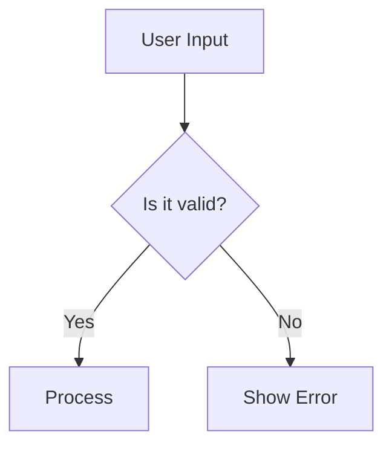

# ai-react-markdown

> A React component library purpose-built for rendering **AI-generated markdown** — LLM streaming, LaTeX math, Mermaid diagrams, GFM, syntax highlighting, CJK-friendly typography, and cross-chunk reference coordination. Batteries included, escape hatches everywhere.

[](https://www.npmjs.com/package/@ai-react-markdown/core)
[](https://www.npmjs.com/package/@ai-react-markdown/mantine)

[](https://www.npmjs.com/package/@ai-react-markdown/core)
[](https://www.npmjs.com/package/@ai-react-markdown/mantine)

[](https://www.typescriptlang.org/)
[](https://react.dev/)
[](https://prettier.io/)
[](./LICENSE)
[](#contributing)
[](https://deepwiki.com/AIEPhoenix/ai-react-markdown)

---

## Why ai-react-markdown?

Most React markdown renderers were designed for **static documents** — blog posts, READMEs, CMS content. AI-generated markdown breaks several of their assumptions:

- **Streaming**: content arrives token-by-token, and the same component must re-render dozens of times per second without flicker.
- **Multi-chunk documents**: a single LLM response is often delivered in multiple chunks (chat UI), each rendered by its own component instance, yet references (`[^footnote]`, `[link][def]`, `![img][def]`) must still resolve across chunks.
- **Math, diagrams, CJK**: AI assistants emit `$E=mc^2$`, `\`\`\`mermaid` blocks, mixed Chinese/English paragraphs, and HTML comments — by default vanilla pipelines mangle these.
- **Untrusted output**: LLM markdown can contain `javascript:` URLs, malformed HTML, and broken footnote definitions. Sanitization needs to be airtight **and** customizable for app-specific schemes.
- **Performance under streaming**: every keystroke from the model triggers a re-render of the full document. Block-level memoization is no longer "nice-to-have", it's table stakes.

This library is opinionated around those problems. Out of the box you get safe LLM rendering with sane defaults; opt-in escape hatches let you customize anything from URL allowlists down to per-element renderers.

## Features

|                              |                                                                                                                                                                                                                                                   |
| ---------------------------- | ------------------------------------------------------------------------------------------------------------------------------------------------------------------------------------------------------------------------------------------------- |
| **GFM**                      | tables, strikethrough, task lists, autolinks (via `remark-gfm`)                                                                                                                                                                                   |
| **LaTeX math**               | inline `$…$` and display `$$…$$` via KaTeX, with smart preprocessing for currency `$`, bracket delimiters (`\[…\]`, `\(…\)`), pipe escaping, and [mhchem](https://mhchem.github.io/MathJax-mhchem/) commands (chemistry formulas like `\ce{H2O}`) |
| **Mermaid diagrams**         | interactive SVG with dark/light themes, source toggle, copy, open-in-new-window (in `@ai-react-markdown/mantine`)                                                                                                                                 |
| **Syntax highlighting**      | language-labelled tabs, expand/collapse, optional `highlight.js` auto-detection for unlabelled blocks (in `@ai-react-markdown/mantine`)                                                                                                           |
| **CJK-friendly**             | proper line breaking for Chinese / Japanese / Korean text plus optional [pangu](https://github.com/vinta/pangu.js) auto-spacing between CJK and half-width characters                                                                             |
| **Streaming-aware**          | `streaming` flag is propagated via context; custom renderers can show cursors, skip animations, or disable copy buttons during streaming                                                                                                          |
| **Streaming cursor**         | built-in `streamingCursor` slot renders a "still generating" indicator after the last streamed character — visible through token stalls, pure-CSS animation, zero impact on the parse pipeline                                                    |
| **Cross-chunk coordination** | `<AIMarkdownDocuments>` wrapper lets chunked chat messages share a `documentId` so footnotes / link refs / image refs resolve across chunks                                                                                                       |
| **Block-level memoization**  | each markdown block is memoized by source identity; unchanged blocks skip `toJsxRuntime` and React reconcile work during streaming. Output is byte-identical to the disabled path                                                                 |
| **Emoji shortcodes**         | `:smile:` → 😄 via `remark-emoji`                                                                                                                                                                                                                 |
| **Extra syntax**             | `==highlight==`, definition lists (PHP Markdown Extra)                                                                                                                                                                                            |
| **Display optimizations**    | SmartyPants typography, HTML comment removal, pangu CJK spacing                                                                                                                                                                                   |
| **Customizable URL safety**  | two-gate XSS protection (`urlTransform` + `rehype-sanitize`); helper to extend the schema without breaking library invariants                                                                                                                     |
| **Custom components**        | swap any HTML-element renderer with a typed component; library defaults are merged underneath                                                                                                                                                     |
| **Custom typography**        | drop-in `Typography` slot with full CSS-variable token surface for spacing, headings, weight, colors                                                                                                                                              |
| **Metadata context**         | pass arbitrary data to nested custom components without prop drilling — isolated from render state so updates don't re-render the document                                                                                                        |
| **TypeScript**               | first-class generics for extended configs and metadata; full IDE autocompletion                                                                                                                                                                   |
| **React 19**                 | uses native `useId()`, properly typed for the current React version                                                                                                                                                                               |

## Packages

| Package                                            | Description                                                                                                                                                                 |
| -------------------------------------------------- | --------------------------------------------------------------------------------------------------------------------------------------------------------------------------- |
| [`@ai-react-markdown/core`](./packages/core)       | Framework-agnostic core renderer. GFM, LaTeX, CJK, streaming, metadata context, custom components, cross-chunk coordination.                                                |
| [`@ai-react-markdown/mantine`](./packages/mantine) | Mantine UI integration. Adds themed typography, code highlighting via `@mantine/code-highlight`, Mermaid diagrams, JSON pretty-print, and automatic color scheme detection. |

## Installation

### Core (framework-agnostic)

```bash
# npm
npm install @ai-react-markdown/core

# pnpm
pnpm add @ai-react-markdown/core

# yarn
yarn add @ai-react-markdown/core
```

### Mantine integration

```bash
# pnpm (illustrative — the same applies to npm / yarn)
pnpm add @ai-react-markdown/mantine @ai-react-markdown/core \
         @mantine/core @mantine/code-highlight highlight.js
```

### Peer Dependencies

| Peer                      | Required by                                    | Version                |
| ------------------------- | ---------------------------------------------- | ---------------------- |
| `react` / `react-dom`     | both packages                                  | `>=19.0.0`             |
| `katex`                   | `core` (optional — only if you import its CSS) | `^0.16.0 \|\| ^0.17.0` |
| `@mantine/core`           | `mantine`                                      | `^9.0.0`               |
| `@mantine/code-highlight` | `mantine`                                      | `^9.0.0`               |
| `highlight.js`            | `mantine`                                      | `^11.11.1`             |

> `katex` is an **optional peer**. It ships transitively via `rehype-katex`, so hoisted installers (npm, yarn classic, default pnpm) resolve `'katex/dist/katex.min.css'` automatically. Strict-isolation installers (yarn PnP, `pnpm --node-linker=isolated`) must install it explicitly. Skip this only if you never render math.

### React version & framework compatibility

| Question                        | Answer                                                                                                                                                                                                                                                                             |
| ------------------------------- | ---------------------------------------------------------------------------------------------------------------------------------------------------------------------------------------------------------------------------------------------------------------------------------- |
| **Does it work with React 18?** | No. The library uses `useId()` and React 19's stricter Strict Mode semantics; the `peerDependencies` are pinned to `>=19.0.0`. If you're on React 18, [`react-markdown`](https://github.com/remarkjs/react-markdown) is the safer choice until you upgrade                         |
| **Next.js (App Router)?**       | Yes. The core package marks `'use client'` at its barrel; the Mantine package's sub-components mark it where needed. In practice, import either component from a file you've marked `'use client'` yourself. CSS imports (KaTeX, typography, Mantine) go in your root `layout.tsx` |
| **Next.js (Pages Router)?**     | Yes — standard CSR usage. The library is SSR-safe (`useId()` is SSR-stable), so server-rendering a static markdown string also works                                                                                                                                               |
| **React Native?**               | No. The renderer depends on the DOM (`<div>`, `<span>`, KaTeX CSS). React Native would need a separate renderer                                                                                                                                                                    |
| **Remix / Vite / CRA?**         | Yes — any React 19 host. The only environment-specific note is the strict-isolation pnpm/yarn-PnP `katex` install (see [Peer Dependencies](#peer-dependencies))                                                                                                                    |

### Development vs production builds

The core package ships two builds (react/redux-style) selected by the `development`
[exports condition](https://nodejs.org/api/packages.html#community-conditions-definitions):
the development build has all warnings and dev-time invariant checks enabled; the
production build has them compiled out. Neither file references `process.env`, so
importing the package without a bundler (browser native ESM, CDN, Deno) is safe and
yields the production build.

Bundlers that understand the condition (Vite, webpack/Next.js in development mode)
pick the right build automatically — nothing to configure.

**Footgun:** a resolver that does _not_ know the condition always gets the
**production** build, even during development. The common case is server-side
rendering with plain Node (no bundler): dev warnings will be silent there. Run Node
with `--conditions=development` if you want them in that setup.

The same applies to **Jest**: its resolver never includes the `development`
condition (regardless of `NODE_ENV`), so consumer test suites exercise the
production build — this package's dev-only warnings and invariant checks will not
fire in tests. Opt back in with
`testEnvironmentOptions: { customExportConditions: ['development', 'node', 'node-addons'] }`
(jest-environment-node; use `['development', 'browser']` with jsdom). Keep the
environment's defaults in the list — `customExportConditions` **replaces** them
rather than adding to them, and dropping `node`/`browser` would misresolve every
other conditional-exports package in the test process.

**Footgun (all dual-build packages — react and redux share it):** resolution
conditions must be consistent within one process. If part of your toolchain inlines
this package under the `development` condition while another part — say an
externalized wrapper like `@ai-react-markdown/mantine` in a partially-inlined
Vitest setup — resolves it through Node without that condition, two copies load
and React contexts split across them: cross-chunk coordination appears silently
dead. Align `deps.inline` / aliases so everything in the process resolves the
same build.

### CSS Imports

Pick the set that matches the package you installed.

**If you installed `@ai-react-markdown/core` only:**

```tsx
import 'katex/dist/katex.min.css'; // required for math
import '@ai-react-markdown/core/typography/default.css'; // default variant only
// or: import '@ai-react-markdown/core/typography/all.css'; // every shipped variant
```

**If you installed `@ai-react-markdown/mantine`** — the Mantine package provides its own typography wrapper, so you do **not** need the core typography CSS unless you also render the standalone `<AIMarkdown>` somewhere:

```tsx
import 'katex/dist/katex.min.css';
import '@mantine/core/styles.css';
import '@mantine/code-highlight/styles.css';
import '@ai-react-markdown/mantine/styles.css';
```

## Quick Start

### Core

```tsx
import AIMarkdown from '@ai-react-markdown/core';
import 'katex/dist/katex.min.css';
import '@ai-react-markdown/core/typography/default.css';

export default function App() {
  return <AIMarkdown content="Hello **world**! Math: $E = mc^2$" />;
}
```

### Mantine

```tsx
import { MantineProvider } from '@mantine/core';
import { CodeHighlightAdapterProvider, createHighlightJsAdapter } from '@mantine/code-highlight';
import hljs from 'highlight.js';
import MantineAIMarkdown from '@ai-react-markdown/mantine';

import '@mantine/core/styles.css';
import '@mantine/code-highlight/styles.css';
import '@ai-react-markdown/mantine/styles.css';
import 'katex/dist/katex.min.css';

const highlightJsAdapter = createHighlightJsAdapter(hljs);

export default function App() {
  return (
    <MantineProvider>
      <CodeHighlightAdapterProvider adapter={highlightJsAdapter}>
        <MantineAIMarkdown content="Hello **world**! Math: $E = mc^2$" />
      </CodeHighlightAdapterProvider>
    </MantineProvider>
  );
}
```

## Recipes

### Stream from an LLM

The `streaming` flag is just a context boolean — pass `true` while tokens are still arriving so descendants can adapt (deferred copy buttons, skipped animations, etc.). The renderer itself remains stable across re-renders thanks to block-level memoization. Add `streamingCursor` for a built-in "still generating" indicator that tracks the last streamed character and stays visible through token stalls ([docs](./docs/streaming-cursor.md)):

```tsx
import AIMarkdown, { AIMarkdownStreamingCursor } from '@ai-react-markdown/core';

function ChatMessage({ message }: { message: { content: string; pending: boolean } }) {
  return (
    <AIMarkdown
      content={message.content}
      streaming={message.pending}
      streamingCursor={AIMarkdownStreamingCursor}
      colorScheme="dark"
    />
  );
}
```

### Render chunked chat messages with cross-chunk references

When a single logical document is delivered in multiple `<AIMarkdown>` instances (e.g. one per chunk, or one per turn within a thread), wrap them in `<AIMarkdownDocuments>` and pass the **same** `documentId` so footnotes, link refs, and image refs resolve across chunks:

```tsx
import AIMarkdown, { AIMarkdownDocuments } from '@ai-react-markdown/core';

function StreamedMessage({ chunks, id }: { chunks: string[]; id: string }) {
  return (
    <AIMarkdownDocuments>
      {chunks.map((chunk, i) => (
        <AIMarkdown key={i} content={chunk} documentId={id} streaming={i === chunks.length - 1} />
      ))}
    </AIMarkdownDocuments>
  );
}
```

Without the wrapper, each `<AIMarkdown>` is independent — its references only resolve within its own content. The wrapper is the **only** thing required to opt into coordination.

### Mermaid diagrams (via Mantine package)

````markdown

````

The Mantine integration renders this as an interactive SVG with dark/light theme switching, a source toggle, copy button, and "open in new window" — no extra setup. The `mermaid` package is a direct dependency of `@ai-react-markdown/mantine`.

### CJK text with auto pangu spacing

Pangu spacing automatically inserts a regular ASCII space between CJK characters and half-width letters/digits, which is the de-facto convention in Chinese, Japanese, and Korean typography. It's on by default. Turn it off explicitly if you don't want it:

```tsx
import { AIMarkdownRenderDisplayOptimizeAbility } from '@ai-react-markdown/core';

<AIMarkdown
  content="今天我用 React 19 重构了 ai-react-markdown 的 streaming 实现。"
  config={{
    displayOptimizeAbilities: [
      AIMarkdownRenderDisplayOptimizeAbility.SMARTYPANTS,
      AIMarkdownRenderDisplayOptimizeAbility.REMOVE_COMMENTS,
      // omit PANGU to disable
    ],
  }}
/>;
```

### Allow a custom URL scheme (e.g. `myapp://`)

Sanitization runs through **two independent gates** for defense in depth: `rehype-sanitize` schema (per-protocol allowlist, runs first in the rehype chain) and `urlTransform` (per-attribute rewriter, runs second at render time). Both must permit a scheme for it to render.

```tsx
import AIMarkdown, { defaultUrlTransform, extendSanitizeSchema } from '@ai-react-markdown/core';

// Module-scope: defined once, stable across renders, keeps the memo cache warm.
const ALLOWED = /^myapp:/i;
const URL_TRANSFORM = (url, key, node) => (ALLOWED.test(url) ? url : defaultUrlTransform(url, key, node));

const SCHEMA = extendSanitizeSchema((s) => {
  s.protocols.href.push('myapp');
  s.protocols.src.push('myapp');
});

export default function App({ content }: { content: string }) {
  return <AIMarkdown content={content} urlTransform={URL_TRANSFORM} sanitizeSchema={SCHEMA} />;
}
```

> ⚠️ Reference stability matters. Inlining `urlTransform={(url) => …}` creates a new closure every render and discards the block-memo cache. Always define at module scope (or memoize with `useMemo`). Development builds emit a `console.warn` after detecting 3+ identity flips. `extendSanitizeSchema` is the only supported way to build a schema — it hands you a deep clone with library invariants (cross-chunk tags, `math-inline`/`math-display` markers on `<code>`, `<mark>`) preserved.

### Replace specific HTML element renderers

```tsx
import AIMarkdown, { type AIMarkdownCustomComponents } from '@ai-react-markdown/core';

const components: AIMarkdownCustomComponents = {
  a: ({ href, children }) => (
    <a href={href} target="_blank" rel="noopener noreferrer">
      {children} ↗
    </a>
  ),
  img: ({ src, alt }) => ,
};

<AIMarkdown content={markdown} customComponents={components} />;
```

In the Mantine package, caller `customComponents` are merged on top of Mantine defaults; including `pre` opts out of Mantine's built-in code-block / Mermaid / JSON pipeline.

### Pass metadata to nested custom components

Metadata lives in a **separate React context** from render state, so updating it (e.g. swapping a `onCopyCode` callback) does not re-render the document body.

```tsx
import AIMarkdown, { useAIMarkdownMetadata, type AIMarkdownCustomComponents } from '@ai-react-markdown/core';

interface ChatMeta {
  messageId: string;
  onCopyCode: (code: string) => void;
}

const components: AIMarkdownCustomComponents = {
  pre: ({ children }) => {
    const meta = useAIMarkdownMetadata<ChatMeta>();
    return (
      <pre>
        <button onClick={() => meta?.onCopyCode(String(children))}>Copy</button>
        {children}
      </pre>
    );
  },
};

<AIMarkdown<typeof defaultConfig, ChatMeta>
  content={markdown}
  customComponents={components}
  metadata={{ messageId: msg.id, onCopyCode: handleCopy }}
/>;
```

### Adapt rendering based on streaming state

```tsx
import { useAIMarkdownRenderState } from '@ai-react-markdown/core';

function MyCodeBlock({ children }: { children: React.ReactNode }) {
  const { streaming, colorScheme } = useAIMarkdownRenderState();
  return <pre className={`${colorScheme} ${streaming ? 'cursor' : ''}`}>{children}</pre>;
}
```

### Strip frontmatter (or any other transform) before rendering

```tsx
import type { AIMDContentPreprocessor } from '@ai-react-markdown/core';

const stripFrontmatter: AIMDContentPreprocessor = (content) => content.replace(/^---[\s\S]*?---\n/, '');

<AIMarkdown content={raw} contentPreprocessors={[stripFrontmatter]} />;
```

Preprocessors run after the built-in LaTeX normalizer, in array order.

## Advanced Customization & Extension

The README covers the 90% case. For deep customization — replacing element renderers, theming, allowing custom URL schemes, coordinating chunked streaming, building your own integration package — see the topic-focused guides under [`docs/`](./docs/):

| Guide                                                             | What it covers                                                                   |
| ----------------------------------------------------------------- | -------------------------------------------------------------------------------- |
| [Custom components](./docs/custom-components.md)                  | Replace renderers for any HTML element with your own React components            |
| [Custom typography](./docs/custom-typography.md)                  | Swap the `Typography` slot; integrate with design systems                        |
| [Design tokens](./docs/design-tokens.md)                          | Complete CSS custom-property surface; retheme without writing JS                 |
| [Content preprocessors](./docs/content-preprocessors.md)          | Transform the raw markdown string before parsing                                 |
| [URL sanitization](./docs/url-sanitization.md)                    | Two-gate sanitization model; allow custom schemes safely                         |
| [Cross-chunk coordination](./docs/cross-chunk-coordination.md)    | Chunked chat messages with references that resolve across chunks                 |
| [Metadata context](./docs/metadata-context.md)                    | Pass callbacks/ids to nested components without prop drilling                    |
| [Streaming & performance](./docs/streaming-and-performance.md)    | Block-level memoization, `streaming` flag, cache-flush footguns                  |
| [TypeScript generics](./docs/typescript-generics.md)              | Extend `AIMarkdownRenderConfig` and `AIMarkdownMetadata` with typed fields       |
| [Extending via a sub-package](./docs/extending-via-subpackage.md) | Ship your own `@yourorg/ai-react-markdown-<integration>`                         |
| [Architecture overview](./docs/architecture.md)                   | Render pipeline, context layering, registry design                               |
| [Streaming chat: end-to-end](./docs/streaming-chat-example.md)    | Copy-runnable SSE chat example — backend route, React client, Next.js App Router |
| [CJK typography](./docs/cjk-typography.md)                        | Chinese / Japanese / Korean text — line breaking, pangu spacing, font stack      |
| [Release highlights](./docs/release-highlights.md)                | What's notable in each version — distilled from the commit log                   |
| [Benchmark](./docs/benchmark.md)                                  | Measured numbers for block-memo × incremental parse, and how to reproduce them   |

> Below this point: the full prop / config / hook / API reference. Most readers can stop here and dive into the customization guides — come back when you need a specific signature.

## `<AIMarkdown>` Props

The full list with all subtleties lives in [`@ai-react-markdown/core` README](./packages/core/README.md). Quick reference:

| Prop                   | Type                             | Default                         | Purpose                                                                                                                                                                                                       |
| ---------------------- | -------------------------------- | ------------------------------- | ------------------------------------------------------------------------------------------------------------------------------------------------------------------------------------------------------------- |
| `content`              | `string`                         | **required**                    | Raw markdown to render                                                                                                                                                                                        |
| `streaming`            | `boolean`                        | `false`                         | Propagated via context for streaming-aware renderers                                                                                                                                                          |
| `fontSize`             | `number \| string`               | `'0.9375rem'`                   | Base font size (numbers → px). Anchors `--aim-font-size-root`                                                                                                                                                 |
| `variant`              | `AIMarkdownVariant`              | `'default'`                     | Typography variant name                                                                                                                                                                                       |
| `colorScheme`          | `AIMarkdownColorScheme`          | `'light'`                       | `'light'`, `'dark'`, or custom                                                                                                                                                                                |
| `config`               | `PartialDeep<TConfig>`           | —                               | Partial render config, deep-merged with defaults                                                                                                                                                              |
| `defaultConfig`        | `TConfig`                        | `defaultAIMarkdownRenderConfig` | Base config (sub-packages can override)                                                                                                                                                                       |
| `metadata`             | `TRenderData`                    | —                               | Arbitrary data for custom components (separate context)                                                                                                                                                       |
| `contentPreprocessors` | `AIMDContentPreprocessor[]`      | `[]`                            | Extra string transforms applied after the LaTeX preprocessor. Ships an optional `createRemendPreprocessor()` factory for streaming tail repair — see [Content Preprocessors](./docs/content-preprocessors.md) |
| `customComponents`     | `AIMarkdownCustomComponents`     | —                               | `react-markdown` component overrides                                                                                                                                                                          |
| `Typography`           | `AIMarkdownTypographyComponent`  | `DefaultTypography`             | Typography wrapper                                                                                                                                                                                            |
| `ExtraStyles`          | `AIMarkdownExtraStylesComponent` | —                               | Optional wrapper between typography and content                                                                                                                                                               |
| `documentId`           | `string`                         | auto via `useId()`              | Stable id namespace for clobberable attributes; share across chunks for cross-chunk coordination                                                                                                              |
| `urlTransform`         | `UrlTransform \| null`           | `defaultUrlTransform`           | Second sanitization gate — per-attribute URL rewriter (runs at render time)                                                                                                                                   |
| `sanitizeSchema`       | `SanitizeSchema`                 | library default                 | First gate — `rehype-sanitize` schema, per-protocol allowlist (build with `extendSanitizeSchema`)                                                                                                             |

> The Mantine package extends this with `codeBlock.*` config options. See its [props table](./packages/mantine/README.md#props-api-reference).

## Render Configuration

`AIMarkdownRenderConfig` controls which optional pipeline features are active. Partial configs are **deep-merged** with the defaults; array values (like `extraSyntaxSupported`) **replace entirely** rather than merging by index.

### `extraSyntaxSupported`

| Value                                         | Effect                                                                                            |
| --------------------------------------------- | ------------------------------------------------------------------------------------------------- |
| `AIMarkdownRenderExtraSyntax.HIGHLIGHT`       | `==highlighted text==` syntax                                                                     |
| `AIMarkdownRenderExtraSyntax.DEFINITION_LIST` | Definition lists ([PHP Markdown Extra](https://michelf.ca/projects/php-markdown/extra/#def-list)) |

### `displayOptimizeAbilities`

| Value                                                    | Effect                                                                                            |
| -------------------------------------------------------- | ------------------------------------------------------------------------------------------------- |
| `AIMarkdownRenderDisplayOptimizeAbility.REMOVE_COMMENTS` | Strip HTML comments                                                                               |
| `AIMarkdownRenderDisplayOptimizeAbility.SMARTYPANTS`     | Curly quotes (the upstream plugin internally disables dash, ellipsis, and backtick substitutions) |
| `AIMarkdownRenderDisplayOptimizeAbility.PANGU`           | Auto-insert spaces between CJK and half-width characters                                          |

### Other config fields

| Field                      | Type      | Default | Purpose                                                                                                                                                                                                                                                                 |
| -------------------------- | --------- | ------- | ----------------------------------------------------------------------------------------------------------------------------------------------------------------------------------------------------------------------------------------------------------------------- |
| `blockMemoEnabled`         | `boolean` | `true`  | Per-block memoization. Output is byte-identical when disabled; set `false` only for debugging                                                                                                                                                                           |
| `incrementalParseEnabled`  | `boolean` | `false` | EXPERIMENTAL. Prefix-freeze incremental parsing: append-only streaming re-parses only the tail (83–94% less pipeline stage time on the benchmark payloads). Output stays deep-equal to a full parse; see [Streaming & Performance](./docs/streaming-and-performance.md) |
| `preserveOrphanReferences` | `boolean` | `true`  | Protect orphan `[^x]: …` defs from being silently dropped during streaming when the reference hasn't arrived yet                                                                                                                                                        |

The Mantine package additionally surfaces:

| Field                                 | Type      | Default | Purpose                                        |
| ------------------------------------- | --------- | ------- | ---------------------------------------------- |
| `codeBlock.defaultExpanded`           | `boolean` | `true`  | Whether code blocks start expanded             |
| `codeBlock.autoDetectUnknownLanguage` | `boolean` | `false` | Use `hljs.highlightAuto` for unlabelled blocks |

## Hooks

Available from `@ai-react-markdown/core`:

| Hook                                  | Returns                                                                            | When to use                                                                                              |
| ------------------------------------- | ---------------------------------------------------------------------------------- | -------------------------------------------------------------------------------------------------------- |
| `useAIMarkdownRenderState<TConfig>()` | `{ streaming, fontSize, variant, colorScheme, documentId, clobberPrefix, config }` | Read render state inside a custom component                                                              |
| `useAIMarkdownMetadata<TMetadata>()`  | `TMetadata \| undefined`                                                           | Read app-specific metadata (callbacks, ids, etc.)                                                        |
| `useDocumentRegistry(documentId)`     | `Registry \| null`                                                                 | Direct access to the cross-chunk registry. `null` when outside `<AIMarkdownDocuments>`                   |
| `useStableValue(value)`               | Same type as input                                                                 | Returns a referentially stable copy via deep-equal; useful when you cannot easily memoize a complex prop |

The Mantine package re-exports typed variants:

| Hook                                         | Notes                                                                                                          |
| -------------------------------------------- | -------------------------------------------------------------------------------------------------------------- |
| `useMantineAIMarkdownRenderState<TConfig>()` | Defaults `TConfig` to `MantineAIMarkdownRenderConfig` so `config.codeBlock.*` is typed without manual generics |
| `useMantineAIMarkdownMetadata<TMetadata>()`  | Defaults `TMetadata` to `MantineAIMarkdownMetadata`                                                            |

## Typography & Theming

The default typography is driven by CSS custom properties anchored to `--aim-font-size-root` — which means **changing the `fontSize` prop proportionally scales every rendered dimension** (spacing, headings, KaTeX, etc.). Override any token in your own stylesheet:

```css
.aim-typography-root.default {
  --aim-spacing-md: calc(var(--aim-font-size-root) * 1.2); /* roomier paragraphs */
  --aim-h1-font-size: calc(var(--aim-font-size-root) * 2.5);
  --aim-font-weight-strong: 600;
  --aim-color-anchor: #ff6b6b;
}
```

Token groups:

| Group                | Tokens                                                                                      |
| -------------------- | ------------------------------------------------------------------------------------------- |
| Spacing              | `--aim-spacing-{xs,sm,md,lg,xl}`                                                            |
| Font size            | `--aim-font-size-{xs,sm,md,lg,xl}`                                                          |
| Heading sizes        | `--aim-h{1..6}-font-size`                                                                   |
| Heading meta         | `--aim-h{1..6}-line-height`, `--aim-h{1..6}-font-weight`                                    |
| Shared weight        | `--aim-font-weight-strong` (default `700`)                                                  |
| KaTeX                | `--aim-katex-font-size`                                                                     |
| Misc                 | `--aim-line-height`, `--aim-radius-sm`, `--aim-font-family-{monospace,headings}`            |
| Color (light / dark) | `--aim-color-{text,dimmed,anchor,border,code-bg,code-text,blockquote-bg,mark-bg,mark-text}` |

> **Stability contract**: token _names_ and _roles_ follow semver. Exact default _values_ may shift under minor bumps as the visual design evolves — override what you need locked.

For a fully custom typography wrapper, replace the `Typography` prop; remember to forward `style` so injected CSS custom properties reach descendants. Full recipe in the [core README](./packages/core/README.md#custom-typography-component).

## TypeScript

The component accepts two generic type parameters — `TConfig` for extended render config and `TRenderData` for metadata:

```tsx
import AIMarkdown, { type AIMarkdownRenderConfig, type AIMarkdownMetadata } from '@ai-react-markdown/core';

interface MyConfig extends AIMarkdownRenderConfig {
  codeBlock: { defaultExpanded: boolean };
}

interface MyMetadata extends AIMarkdownMetadata {
  messageId: string;
}

<AIMarkdown<MyConfig, MyMetadata>
  content={markdown}
  defaultConfig={myDefaultConfig}
  config={{ codeBlock: { defaultExpanded: false } }}
  metadata={{ messageId: '123' }}
/>;
```

Both hooks accept matching generics. Sub-packages like `@ai-react-markdown/mantine` use this pattern to extend the base config with `codeBlock` options while inheriting everything else unchanged.

## Security: Two-Gate URL Sanitization

By default `<AIMarkdown>` only renders URLs whose protocols are in the same allowlist `react-markdown` / GitHub use: `http`, `https`, `irc`, `ircs`, `mailto`, `xmpp`. Anything else — `javascript:`, `data:`, your own `customscheme://` — is stripped. This protects against XSS in LLM-generated markdown.

Two gates run in sequence:

1. **`rehype-sanitize` schema** — runs first (in the rehype plugin chain), drops URLs whose protocol is not in the schema's per-attribute allowlist (`protocols.href`, `protocols.src`, `protocols.cite`).
2. **`urlTransform`** — runs second, on every URL-bearing attribute during render-time traversal. Receives the attribute name (`'href'` / `'src'` / …) so policies can discriminate (e.g. allow a scheme on `<a>` but not on ``).

For a scheme to render, **both must permit it**. This is intentional defense-in-depth. Use `defaultUrlTransform` + `extendSanitizeSchema` (see the [recipe above](#allow-a-custom-url-scheme-eg-myapp)) to opt into additional schemes without breaking other invariants (cross-chunk tags, KaTeX classes, `<mark>`).

> Full sanitize-schema reference, footguns, and the asymmetric reference-stability rules for `urlTransform` vs `sanitizeSchema` are documented in the [core README's security section](./packages/core/README.md#custom-url-schemes-and-sanitization).

## Cross-Chunk Coordination Reference

| Export                                                                    | Shape                                     | Purpose                                                         |
| ------------------------------------------------------------------------- | ----------------------------------------- | --------------------------------------------------------------- |
| `<AIMarkdownDocuments>`                                                   | `{ children, preserveOrphanReferences? }` | Wrap a group of `<AIMarkdown>` chunks that share a `documentId` |
| `useDocumentRegistry(documentId)`                                         | `Registry \| null`                        | Read the shared registry inside a custom component              |
| `Registry`, `ChunkData`, `FootnoteDef`, `LinkDef`, `RefRecord`, `RefKind` | exported types                            | For typed helpers that operate on the registry directly         |

The `preserveOrphanReferences` prop on `<AIMarkdownDocuments>` unconditionally overrides each chunk's `config.preserveOrphanReferences` — useful when the wrapper-level policy should always win.

`<MantineAIMarkdown>` participates in coordination identically; nest it inside `<AIMarkdownDocuments>` the same way.

## Exported API at a Glance

### `@ai-react-markdown/core`

```ts
// Default export
import AIMarkdown from '@ai-react-markdown/core';

// Components
import { AIMarkdownDocuments } from '@ai-react-markdown/core';

// Hooks
import {
  useAIMarkdownRenderState,
  useAIMarkdownMetadata,
  useDocumentRegistry,
  useStableValue,
} from '@ai-react-markdown/core';

// Constants & helpers
import {
  defaultAIMarkdownRenderConfig,
  defaultUrlTransform,
  extendSanitizeSchema,
  AIMarkdownRenderExtraSyntax,
  AIMarkdownRenderDisplayOptimizeAbility,
} from '@ai-react-markdown/core';

// Types
import type {
  AIMarkdownProps,
  AIMarkdownDocumentsProps,
  AIMarkdownCustomComponents,
  AIMarkdownRenderConfig,
  AIMarkdownRenderState,
  AIMarkdownMetadata,
  AIMarkdownTypographyProps,
  AIMarkdownTypographyComponent,
  AIMarkdownExtraStylesProps,
  AIMarkdownExtraStylesComponent,
  AIMarkdownVariant,
  AIMarkdownColorScheme,
  AIMDContentPreprocessor,
  UrlTransform,
  SanitizeSchema,
  PartialDeep,
  Registry,
  ChunkData,
  FootnoteDef,
  LinkDef,
  RefRecord,
  RefKind,
} from '@ai-react-markdown/core';
```

### `@ai-react-markdown/mantine`

```ts
// Default export
import MantineAIMarkdown from '@ai-react-markdown/mantine';

// Components
import { MantineAIMarkdownTypography, MantineAIMDefaultExtraStyles } from '@ai-react-markdown/mantine';

// Hooks
import { useMantineAIMarkdownRenderState, useMantineAIMarkdownMetadata } from '@ai-react-markdown/mantine';

// Constants
import { defaultMantineAIMarkdownRenderConfig } from '@ai-react-markdown/mantine';

// Types
import type {
  MantineAIMarkdownProps,
  MantineAIMarkdownRenderConfig,
  MantineAIMarkdownMetadata,
} from '@ai-react-markdown/mantine';
```

## Architecture

```text
<AIMarkdown>
  <AIMarkdownMetadataProvider>          // Separate context for metadata
    <AIMarkdownRenderStateProvider>     // Context for streaming, config, scheme, etc.
      <Typography>                      // Configurable typography wrapper
        <ExtraStyles?>                  // Optional extra style wrapper
          <AIMarkdownContent />         // react-markdown with the remark/rehype pipeline
        </ExtraStyles?>
      </Typography>
    </AIMarkdownRenderStateProvider>
  </AIMarkdownMetadataProvider>
</AIMarkdown>
```

Metadata and render state live in **separate contexts** so metadata changes (e.g. swapping a `onCopyCode` callback) do not re-render `AIMarkdownContent`, which only consumes render state.

The Mantine package wraps `<AIMarkdown>` with:

- `Typography = MantineAIMarkdownTypography` (Mantine `<Typography>`)
- `ExtraStyles = MantineAIMDefaultExtraStyles` (CSS scoping for em-based Mantine tokens)
- `customComponents.pre = MantineAIMPreCode` (CodeHighlight + Mermaid + JSON pretty-print)
- `colorScheme = useComputedColorScheme('light')` when not overridden

## Development

```bash
# Install dependencies (pnpm required)
pnpm install

# Build all packages
pnpm build

# Run Storybook (interactive playground for development)
pnpm storybook

# Lint / autofix
pnpm lint
pnpm lint:fix

# Format
pnpm format
pnpm format:check

# Per-package tests (vitest)
pnpm --filter @ai-react-markdown/core test
pnpm --filter @ai-react-markdown/core typecheck
```

## Contributing

Issues and pull requests are welcome. For non-trivial changes, please open an issue first so we can discuss design and scope.

Reporting a bug helps most when it includes:

- The package and version (`@ai-react-markdown/core@1.7.0` …)
- The relevant `<AIMarkdown>` / `<MantineAIMarkdown>` props
- A minimal markdown sample that reproduces the issue
- For streaming-related bugs: the chunk sequence (one string per chunk)

## License

[MIT](./LICENSE) © [@AIEPhoenix](https://github.com/AIEPhoenix)
