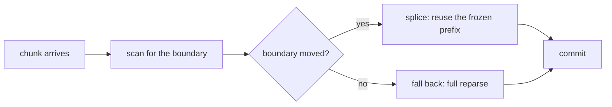
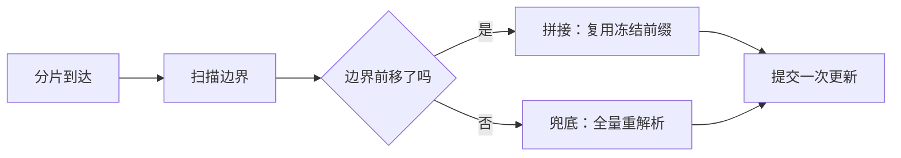

# Markdown corpus

The engine enables fourteen remark and rehype plugins and the previous corpus
exercised none of them. 45 cases, roughly half of them
negative: a rewriter is only as good as what it declines to touch, so a colon
in a URL, a `--` in code and a `~~` in a file path are all here to stay
unchanged.

## GFM

Tables, task lists, strikethrough, autolinks and footnotes.

### gfm-table-alignment

All three column alignments, and cells of very uneven width.

| Left | Centre | Right | Default |
| :--- | :----: | ----: | ------- |
| a | b | c | d |
| a much longer cell than its neighbours | x | 1 | — |
| | empty leading cell | 1,000,000 | |

### gfm-table-inline-content

Every inline construct inside table cells, where the pipe is the hazard.

| Construct | Example | Note |
| --- | --- | --- |
| code | `a \| b` | a pipe inside a span |
| link | [spec](https://example.test) | |
| image |  | |
| emphasis | *em* **strong** ***both*** | |
| strike | ~~gone~~ | |
| mark | ==kept== | |
| math | $x^2$ | |
| break | one<br>two | an HTML break inside a cell |

### gfm-table-wide

A table far wider than any viewport — horizontal overflow, not wrapping.

| id | scenario | app | bytes | streamMs | settleMs | commits | chunks | domNodes | renderedNodes | longTasks | totalBlockingMs | rafP95Ms | outcome |
| --- | --- | --- | ---: | ---: | ---: | ---: | ---: | ---: | ---: | ---: | ---: | ---: | --- |
| 1 | cold-short | react-core | 2152 | 4 | 14 | 1 | 1 | 214 | 8 | 0 | 0 | 8.4 | settled |
| 2 | cold-xlong | react-core | 1206784 | 11 | 4998 | 1 | 1 | 5224 | 5018 | 3 | 412 | 91.2 | settled |
| 3 | steps-xlong | react-core | 1206784 | 2190 | 95 | 100 | 100 | 5224 | 5018 | 1 | 84 | 22.7 | settled |

### gfm-task-list

Task list items, including nested ones and a mixed ordinary list.

- [x] Generate the math layer from KaTeX's tables
- [x] Cover all 31 mermaid types
  - [x] Parse-verify every case
  - [ ] Group them by family in the emitted document
- [ ] Wire the five existing corpora onto this one
  - [ ] `benchmarks/kit`
  - [ ] `packages/engine/src/fixtures`
- an ordinary item with no checkbox
- [ ] a task whose text contains [brackets] and `[x]` literally

### gfm-strikethrough

Strikethrough, and the shapes that must not become one.

The ~~old corpus~~ new corpus covers ~~five~~ ~~fourteen~~ every plugin.

Not strikethrough: a path like `~/.claude/settings.json`, a home directory ~,
an approximation ~500ms, and a tilde fence marker ~~~ on its own.

### gfm-autolink

Bare URLs and emails become links; the lookalikes must not.

Docs live at https://example.test/docs and issues at
https://example.test/issues?q=is%3Aopen+label%3Abug#top. Mail
corpus@example.test for access.

Not autolinks: the word example.test in prose, a version like v11.16.1, a
scoped package @bench/corpus, and a URL inside code: `https://example.test`.

### gfm-footnotes

Footnote references and definitions, including multi-paragraph and out-of-order ones.

The exponent is 1.22[^fit], but the per-update floor is the real
finding[^floor], and the whole reading was nearly wrong[^wrong].

[^floor]: Defined out of order deliberately — the renderer has to collect
    definitions before it can place them.

    A second paragraph inside a footnote, which is what the four-space
    continuation is for.

[^fit]: A least-squares slope over four points on one machine.
[^wrong]: See `b7a7cc3`, and the correction in `e11bdb6`.

### gfm-footnote-reused

One definition referenced three times, plus a reference with no definition.

Measured on the laptop[^env], again after the fix[^env], and once more
under throttle[^env]. The remote machine[^missing] was not used.

[^env]: macOS, unthrottled, four kept samples per cell.


## Inline constructs

Emphasis, ==mark==, emoji shortcodes, smart punctuation, entities and hard breaks.

### inline-emphasis

Every emphasis form, including the intraword cases the rules differ on.

*em* and _em_, **strong** and __strong__, ***both*** and ___both___,
**_mixed_** and _**mixed**_.

Intraword: snake_case_name stays whole, but un*bel*ievable emphasises.
Escaped: \*not emphasis\* and \_not emphasis\_.

### inline-mark

==mark== from remark-mark-highlight, and what must not become one.

The floor is ==1.6 ms per update==, which is ==98%== of a 24-character
update.

Not a mark: an equality `a == b`, a comparison in prose (x == y), and an
escaped \==pair\==.

### inline-emoji

Emoji shortcodes from remark-emoji, and the colons that are not shortcodes.

Status :white_check_mark: green, :warning: watch, :x: failed.
Also :rocket: :tada: :bug: :mag: :hammer_and_wrench:.

Not shortcodes: a time 12:30, a ratio 33:1, a URL https://example.test,
a YAML key `key: value`, and a Windows path C:\Users.

### inline-smartypants

Smart quotes, dashes and ellipses — and the code that must keep straight ones.

He said "the gate is a green light" -- and it was. It's the checker's
job... not the corpus's.

Ranges use an en dash: pages 10-20, 2026-08-31.

In code they must stay straight: `const s = "it's ok";` and `a -- b`
and `x...y`.

### inline-entities-escapes

HTML entities and backslash escapes.

Entities: &amp; &lt; &gt; &quot; &copy; &mdash; &hellip; &#8212; &#x2014;
&nbsp;between&nbsp;words.

Escapes: \* \_ \# \[ \] \( \) \` \\ \| \~ \= \$ \! \+ \- \.

### inline-breaks

Remark-breaks makes a single newline a hard break — the plugin most visible in prose.

First line.
Second line, after a single newline.
Third.

A new paragraph, after a blank line.

Trailing-space form:  
also a hard break.

Backslash form:\
also a hard break.


## Links and images

Every link form, and images from a real endpoint so they decode and lay out — a 1x1 pixel cannot shift a page under a reader.

### image-reference

Reference-style IMAGES — a distinct mdast node from a reference link, and absent until measured.

Full reference: ![the freeze boundary][boundary]

Collapsed reference: ![boundary][]

Shortcut reference: ![boundary]

A definition with a title, and one reference that resolves to nothing:

![missing][no-such-label]

[boundary]: https://loremflickr.com/320/240 'The offset before which output cannot change'

### link-forms

Every link form, including reference styles and one with a title.

An [inline link](https://example.test/a), one [with a title](https://example.test/b "The title"),
a [reference link][ref], a [collapsed one][], and a [shortcut one].

An empty-text link: [](https://example.test/c). A link with formatting:
[**bold** and `code`](https://example.test/d).

[ref]: https://example.test/ref "Reference title"
[collapsed one]: https://example.test/collapsed
[shortcut one]: https://example.test/shortcut

### link-hash-and-escapes

In-document anchors and URLs full of characters that need escaping.

Jump to [the scale section](#scale--one-size-axis-three-families) or
[a footnote](#user-content-fn-floor).

Awkward URLs: [parens](https://example.test/a_(b)_c),
[spaces](<https://example.test/a b c>),
[query](https://example.test/s?q=a%20b&n=1#frag).

### image-unwrapped

An image alone in a paragraph — rehype-unwrap-images removes the wrapper.


### image-inline-and-linked

Images that are NOT alone, so the wrapper must stay, plus a linked image.

Text before  and text after.

[](https://example.test/target)

Two in one paragraph:  

With a title, which rides on the node rather than in the alt text:


### image-gallery

Several images arriving late — the layout-shift shape a streaming reader notices.


### image-broken

An image that will not load — alt text and the box it leaves behind.


## Block structure

Headings, nested lists, definition lists, quotes and thematic breaks.

### block-indented-code

Indented code — a separate block construct from a fence, and the one that interacts with list indentation.

An indented block, four spaces, no language and no fence:

    const boundary = computeFreezeBoundary(text);
    if (boundary === 0) return fallback();

A fence with no info string, which parses to the same node type:

```
plain text, no highlighting requested
```

Inside a list item, where the indentation has to be counted twice:

1.  A step.

        indented code inside the item

2.  The next step.

> Inside a blockquote:
>
>     indented code inside the quote

### block-headings

Both heading syntaxes at every level, plus one with inline formatting.

# Level one

## Level two

### Level three

#### Level four

##### Level five

###### Level six

Setext level one
================

Setext level two
----------------

## A heading with `code`, *emphasis* and a [link](https://example.test)

### block-lists-nested

Ordered and unordered nesting, a custom start, and loose against tight in both flavours.

1. First
2. Second
   - nested unordered
   - another
     1. and ordered again
     2. deeper
3. Third

Starting at seven:

7. seven
8. eight

A loose ORDERED list, which carries a different spread flag from the bullet one below:

1. first item, with a blank line after it

2. second item

3. third item

Loose list — note the blank lines:

- item one

- item two

Tight list:
- item one
- item two

### block-definition-list

Remark-definition-list — a construct no other corpus in this repo contains.

Freeze boundary
: The offset before which rendered output cannot change.

Terminal case
: A fixture that opens a construct it never closes.
: A second definition for the same term.

Soak
: The six-leg fresh-seed run that gates a release.

  A second paragraph inside a definition.

### block-quotes

Nested quotes, lazy continuation, and a quote containing other blocks.

> A quote.
>
> > Nested one level.
> >
> > > And two.

> A quote with lazy continuation
that carries on without the marker.

> A quote containing a list:
>
> - one
> - two
>
> and a fence:
>
> ```ts
> const x = 1;
> ```

### block-thematic-breaks

Every thematic-break spelling.

Before.

---

Between.

***

Between.

___

Between.

- - -

After.

### block-squeeze

The empty paragraphs remark-squeeze-paragraphs removes.

First paragraph.

<!-- a comment between paragraphs -->

Second paragraph.

<div></div>

Third paragraph.


## Raw HTML

The rehype-raw path, including what rehype-sanitize is expected to strip.

### html-inline

Inline HTML mixed into prose — the rehype-raw path.

Text with <strong>bold</strong>, <em>italic</em>, <code>code</code>,
<kbd>Ctrl</kbd>+<kbd>C</kbd>, <sub>sub</sub> and <sup>sup</sup>, plus a
<span style="color: rebeccapurple">styled span</span> and an
<abbr title="Total Blocking Time">TBT</abbr>.

### html-block

Block-level HTML containing markdown, which rehype-raw has to reconcile.

<details>
<summary>What the gate checks</summary>

Every claim the corpus makes, against the tool that would render it:

- mermaid parses
- math renders
- documents do not swallow their tails

</details>

<figure>
  
  <figcaption>An image inside a figure element.</figcaption>
</figure>

### html-table

An HTML table, which takes a different path from a GFM one.

<table>
  <thead>
    <tr><th>Family</th><th>Updates</th><th align="right">1.15 MB</th></tr>
  </thead>
  <tbody>
    <tr><td>cold</td><td>1</td><td align="right">5009 ms</td></tr>
    <tr><td>steps</td><td>100</td><td align="right">2285 ms</td></tr>
    <tr><td>scale</td><td>50283</td><td align="right">did not finish</td></tr>
  </tbody>
</table>

### html-comments

HTML comments, which remark-remove-comments strips.

<!-- a leading comment -->
Visible text.
<!-- a comment
     spanning
     several lines -->
More visible text. <!-- a trailing inline comment -->

### html-sanitize-hazards

What rehype-sanitize must strip — present so the corpus states the expected outcome rather than avoiding the subject.

<script>window.__corpus = 'must not run';</script>


<a href="javascript:void(0)">a javascript: href</a>

<iframe src="https://example.test"></iframe>

<style>body { display: none; }</style>


## CJK

Three of the fourteen plugins exist for this, and the old corpus was pure ASCII.

### cjk-emphasis-boundary

Emphasis touching CJK with no surrounding space — what remark-cjk-friendly fixes.

这是**加粗**的文字，这是*斜体*的文字，这是***两者***的文字。

英文中的 **bold** 需要空格，中文里的**加粗**不需要。

带标点的边界：「**引号内加粗**」、（**括号内**）、**句末加粗**。

### cjk-strikethrough-boundary

The same boundary problem for ~~, which needs its own plugin.

原来的结论是~~超线性~~，实际是~~渲染成本~~更新次数。

混排：the ~~old~~ 新的语料，以及~~中文删除线~~后面紧跟文字。

### cjk-pangu-spacing

Remark-pangu inserting space between CJK and Latin, digits and symbols.

在 config.ts 里加了 3 行代码，覆盖率从 20% 涨到 98%。

冻结边界扫描器处理 1139 个 KaTeX 标识符和 31 种 mermaid 图表，耗时 5009ms。

已有空格的不该再加：已经 有 空格 的情况。

代码里不该加：`const 变量名 = 1` 和 `文件.ts`。

### cjk-mixed-document

A whole answer in mixed CJK and Latin — the shape this library is actually for.

## 增量解析的三个不变量

引擎在流式渲染时依赖三条不变量，改动 `computeFreezeBoundary` 前必须逐条确认：

1. **前缀冻结**：边界之前的输出不会再变，所以可以复用上一次的 hast。
2. **续扫**：扫描器从 `cp.confirmedOffset` 开始，只走新确认的行，代价是 O(delta)。
3. **保守优先**：拿不准时 over-block 而不是 under-block——少复用只是慢，错复用是错。

实测数据（react-core，不限速）：

| 交付方式 | 148KB | 1.15MB |
| --- | ---: | ---: |
| 一次性 | 229ms | 5009ms |
| 100 次 | 324ms | 2285ms |
| 每 24 字符 | 10315ms | 跑不完 |

### cjk-other-scripts

Japanese, Korean, and scripts with different width and direction behaviour.

日本語：ストリーミング中のマークダウンを**レンダリング**します。

한국어: 스트리밍 마크다운을 **렌더링**합니다.

Ελληνικά: απόδοση ροής markdown.

Русский: потоковый рендеринг markdown.

العربية: عرض ماركداون المتدفق — right-to-left inside a left-to-right document.

Emoji as text: 🎉 👩‍💻 🇯🇵 — including a ZWJ sequence and a flag.

### cjk-full-width-punctuation

Full-width punctuation next to markdown syntax characters.

使用「引号」和（括号），以及：冒号、分号；还有句号。

标点紧邻语法字符：**加粗**。*斜体*，`代码`；[链接](https://example.test)！

全角与半角混用：这是 100% 的覆盖率（不是 100％）。


## Mixed

Code, math and mermaid INSIDE these constructs. Every other document in this corpus is deep in one domain and shallow across domains, so a node-type census over all of them reads as full coverage while none of these combinations occurred — the missing thing is a pair, and pairs have a product for a denominator.

### mixed-answer-shape

The whole shape of one answer — prose, inline math, inline code, a fence, a display block and a diagram.

The freeze boundary is the offset before which rendered output cannot
change. Everything before it is reused; everything after it is reparsed on
every chunk, which is why the cost of one update is `O(tail)` rather than
`O(document)` — as long as the boundary keeps moving.

For a document of $n$ characters arriving in $k$ chunks, the naive cost is

$$
C_{\text{naive}} = \sum_{i=1}^{k} O(n_i) = O(nk)
$$

while the incremental path pays only for the unfrozen tail:

$$
C_{\text{incremental}} = \sum_{i=1}^{k} O(n_i - b_i)
$$

where $b_i$ is the boundary after chunk $i$. The scanner that computes it:

```ts
export function computeFreezeBoundary(text: string, options: ScanOptions): ScanResult {
  const lines = splitLines(text);
  let boundary = 0;
  for (const line of lines) {
    if (isHazardous(line, options)) break;
    boundary = line.end;
  }
  return { boundary, checkpoint: null };
}
```

And the path a chunk takes through it:



The fallback is not a failure — it is the correct answer, arrived at the
expensive way.

### mixed-in-table-cells

Code spans, math and links inside table cells, where the pipe belongs to the table.

| Path | Cost | Formula | Notes |
| --- | ---: | --- | --- |
| Full reparse | $O(nk)$ | $\sum_{i=1}^{k} n_i$ | the baseline |
| Incremental | $O(n)$ amortised | $\sum_{i=1}^{k} (n_i - b_i)$ | when the boundary moves |
| Frozen prefix | $O(1)$ | $b_i$ | reused verbatim |
| Call | — | `computeFreezeBoundary(text, opts)` | see [the scanner](#scanner) |
| Escaped pipe | — | $a \vert b$ | a pipe the table must not eat |
| 中文一列 | 二十毫秒 | $\alpha + \beta$ | 混排单元格 |

### mixed-in-list-items

Fences and display math inside list items, where indentation decides what a block even is.

Three things happen per chunk:

1.  **Scan.** Walk the new lines and find the first hazardous one.

    ```ts
    const { boundary } = computeFreezeBoundary(text, { defListEnabled });
    ```

2.  **Compare.** The boundary must be monotone within a lineage:

    $$
    b_{i+1} \geq b_i \quad \text{for every append}
    $$

    If it is not, the splice is abandoned and the frame falls back.

3.  **Splice.** Reuse the prefix, reparse the tail:

    - the prefix costs $O(1)$
    - the tail costs $O(n_i - b_i)$
    - the join is where every bug in this engine has lived

        indented code nested inside a list item, four spaces past the marker

4.  **Commit.** One React update.

### mixed-in-footnotes

Code and math inside footnote definitions, whose continuation rules span lines.

The scanner is approximate in the safe direction[^approx], and the
boundary is monotone only within one lineage[^lineage].

[^approx]: It over-blocks rather than under-blocks. An over-block costs
    freeze rate; an under-block is a correctness bug, because the frozen
    prefix would then change under an append:

    $$
    \text{raw}(p + t) = \text{raw}(p) + \text{raw}(t)
    $$

    That identity is the whole contract.

[^lineage]: A non-append resets it. In code:

    ```ts
    if (!source.startsWith(prevSource)) {
      frozenSrcEnd = 0;
      frozenOut = '';
    }
    ```

    A regenerated answer is a new lineage, not a shorter one.

### mixed-in-blockquote

A fence and a diagram inside a blockquote, where every inner line carries a marker the inner parser must not see.

> **From the design review.**
>
> The two entry points must agree byte for byte:
>
> $$
> \text{preprocess}(s) = \text{incremental}(s) \quad \forall s
> $$
>
> which is checked like this:
>
> ```ts
> expect(incremental(acc)).toBe(preprocessLaTeX(acc));
> ```
>
> and the shape it is checking:
>
> ```mermaid
> flowchart TD
>   S[stateless entry] --> C{same bytes?}
>   I[incremental entry] --> C
>   C -->|yes| OK[contract holds]
>   C -->|no| BUG[divergence]
> ```
>
> — the reviewer, who was right

### mixed-cjk-answer

The realistic CJK answer: Chinese prose carrying code, math and a diagram.

冻结边界指的是「这个偏移之前的输出不会再变」。边界之前直接复用，边界之后每来一个分片都要重新解析——所以一次更新的成本是 `O(尾部)` 而不是 `O(全文)`。

设文档有 $n$ 个字符、分 $k$ 个分片到达，朴素做法的总成本是

$$
C_{\text{朴素}} = \sum_{i=1}^{k} O(n_i) = O(nk)
$$

增量路径只为未冻结的尾部付费：

```ts
const { boundary } = computeFreezeBoundary(text, { defListEnabled });
if (boundary > previousBoundary) {
  return spliceParse(frozenPrefix, text.slice(boundary));
}
```

| 路径 | 成本 | 何时发生 |
| --- | --- | --- |
| 全量重解析 | $O(nk)$ | 边界不前移 |
| 增量拼接 | $O(n)$ 摊还 | 边界前移 |



兜底不是失败，它是用贵的方式得到的正确答案。

