# Mermaid corpus

76 cases covering all 31 diagram types that mermaid registers,
including a CJK group whose labels are Chinese, Japanese and Korean. Every one
is parse-verified against the installed version; several of these types are
beta and their grammar moves between minors.

Diagrams mermaid REJECTS are deliberately absent — this document's contract is
that all of it renders. They are pinned in `src/mermaid/nonAscii.ts` instead,
each beside the form that works.

### flowchart-basic

The baseline: a linear chain, top-down.

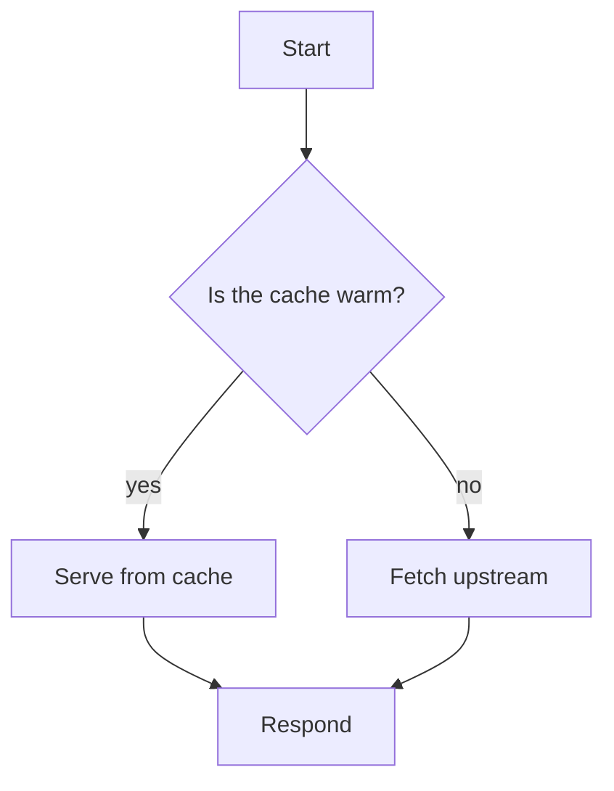
```mermaid
flowchart TD
  A[Start] --> B{Is the cache warm?}
  B -->|yes| C[Serve from cache]
  B -->|no| D[Fetch upstream]
  C --> E[Respond]
  D --> E
```

### flowchart-shapes

Every node shape — each is a different SVG path generator.

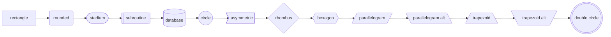
```mermaid
flowchart LR
  a[rectangle] --> b(rounded)
  b --> c([stadium])
  c --> d[[subroutine]]
  d --> e[(database)]
  e --> f((circle))
  f --> g>asymmetric]
  g --> h{rhombus}
  h --> i{{hexagon}}
  i --> j[/parallelogram/]
  j --> k[\parallelogram alt\]
  k --> l[/trapezoid\]
  l --> m[\trapezoid alt/]
  m --> n(((double circle)))
```

### flowchart-links

Every link style — arrows, thickness, dotted, multi-directional.

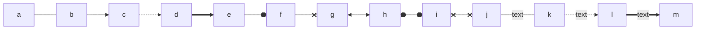
```mermaid
flowchart LR
  a --- b
  b --> c
  c -.-> d
  d ==> e
  e --o f
  f --x g
  g <--> h
  h o--o i
  i x--x j
  j -- text --- k
  k -.text.-> l
  l == text ==> m
```

### flowchart-subgraph

Nested subgraphs — a layout pass the flat chart never runs.

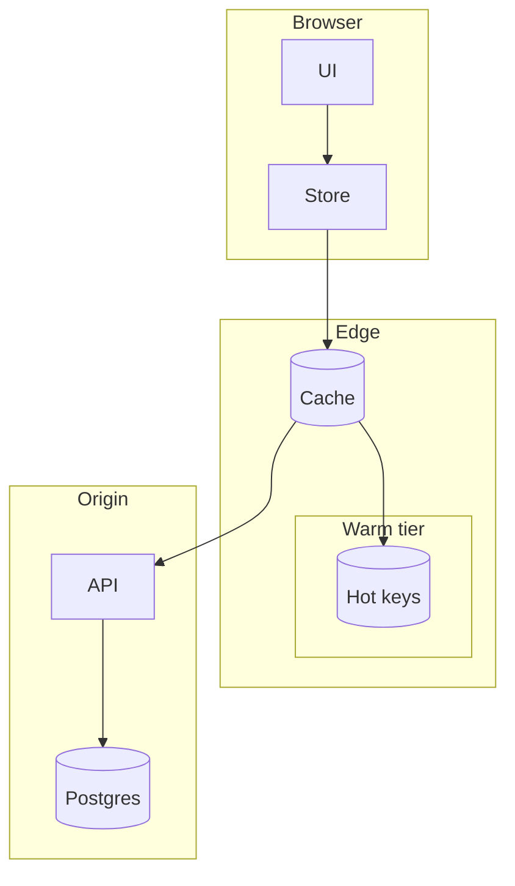
```mermaid
flowchart TB
  subgraph client [Browser]
    direction LR
    ui[UI] --> store[Store]
  end
  subgraph edge [Edge]
    direction TB
    cache[(Cache)]
    subgraph inner [Warm tier]
      hot[(Hot keys)]
    end
    cache --> hot
  end
  subgraph origin [Origin]
    api[API] --> db[(Postgres)]
  end
  store --> cache
  cache --> api
```

### flowchart-styling

ClassDef, class assignment, inline style and link styling.

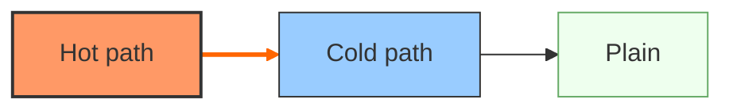
```mermaid
flowchart LR
  classDef hot fill:#f96,stroke:#333,stroke-width:2px
  classDef cold fill:#9cf,stroke:#333
  a[Hot path]:::hot --> b[Cold path]:::cold
  b --> c[Plain]
  style c fill:#efe,stroke:#6a6
  linkStyle 0 stroke:#f60,stroke-width:3px
```

### sequence-basic

Participants and plain messages.

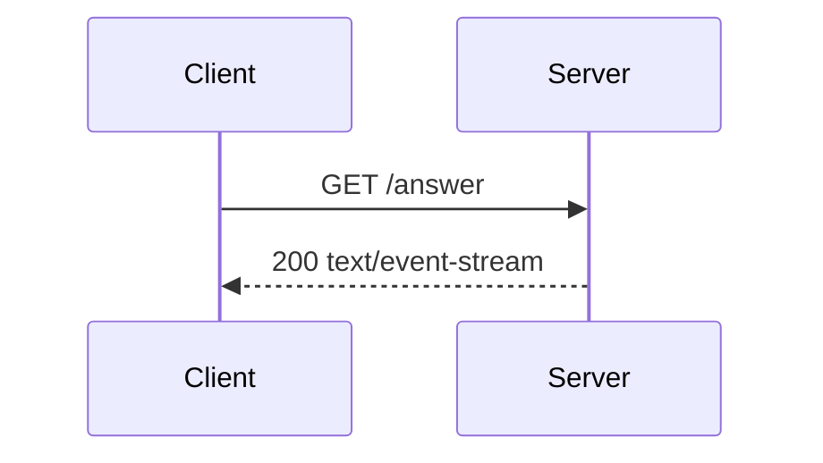
```mermaid
sequenceDiagram
  participant C as Client
  participant S as Server
  C->>S: GET /answer
  S-->>C: 200 text/event-stream
```

### sequence-blocks

Loop / alt / opt / par — each draws a labelled frame.

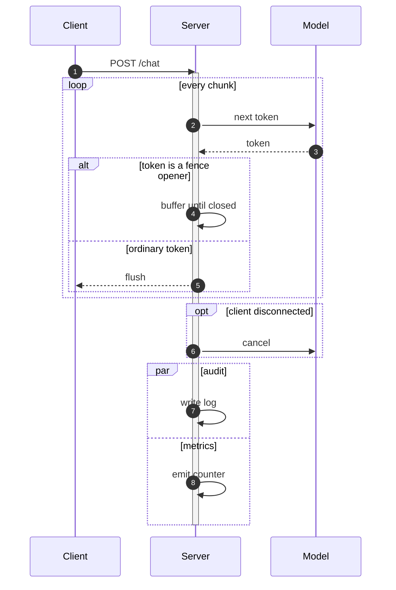
```mermaid
sequenceDiagram
  autonumber
  participant C as Client
  participant S as Server
  participant M as Model
  C->>S: POST /chat
  activate S
  loop every chunk
    S->>M: next token
    M-->>S: token
    alt token is a fence opener
      S->>S: buffer until closed
    else ordinary token
      S-->>C: flush
    end
  end
  opt client disconnected
    S->>M: cancel
  end
  par audit
    S->>S: write log
  and metrics
    S->>S: emit counter
  end
  deactivate S
```

### sequence-notes

Notes, boxes and self-messages — free-floating layout.

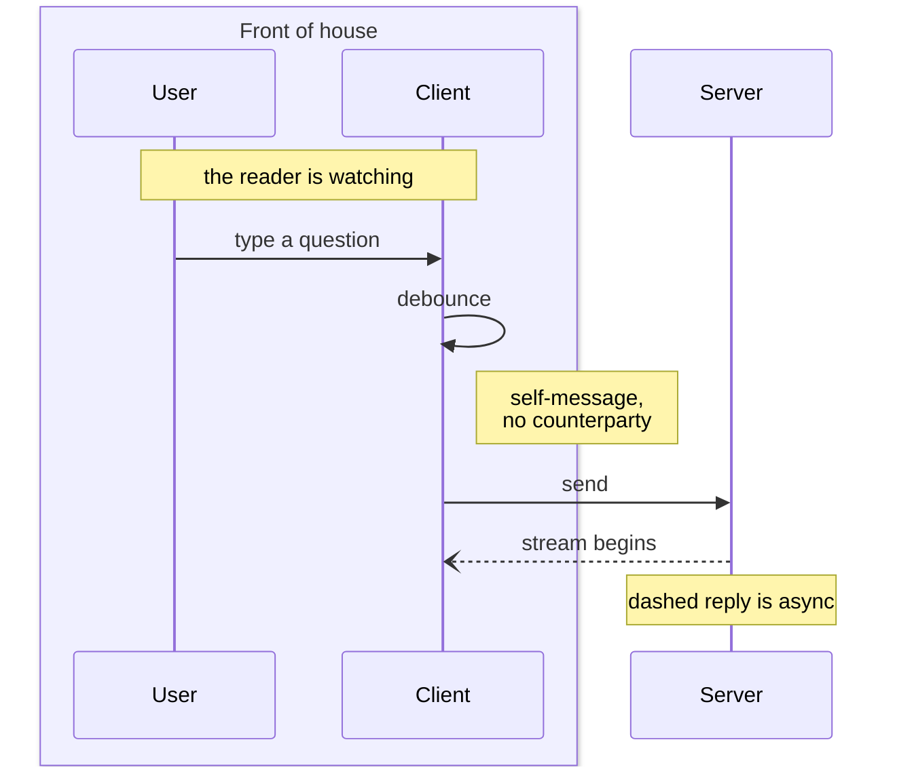
```mermaid
sequenceDiagram
  box rgb(240,240,255) Front of house
    participant U as User
    participant C as Client
  end
  participant S as Server
  Note over U,C: the reader is watching
  U->>C: type a question
  C->>C: debounce
  Note right of C: self-message,<br/>no counterparty
  C->>S: send
  S--)C: stream begins
  Note over S: dashed reply is async
```

### class-basic

Classes, members, visibility markers.

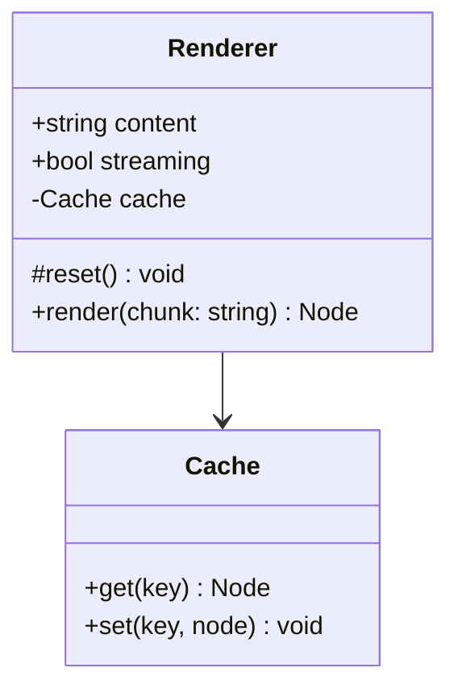
```mermaid
classDiagram
  class Renderer {
    +string content
    +bool streaming
    -Cache cache
    #reset() void
    +render(chunk: string) Node
  }
  class Cache {
    +get(key) Node
    +set(key, node) void
  }
  Renderer --> Cache
```

### class-relations

Every relation arrowhead, plus generics and annotations.

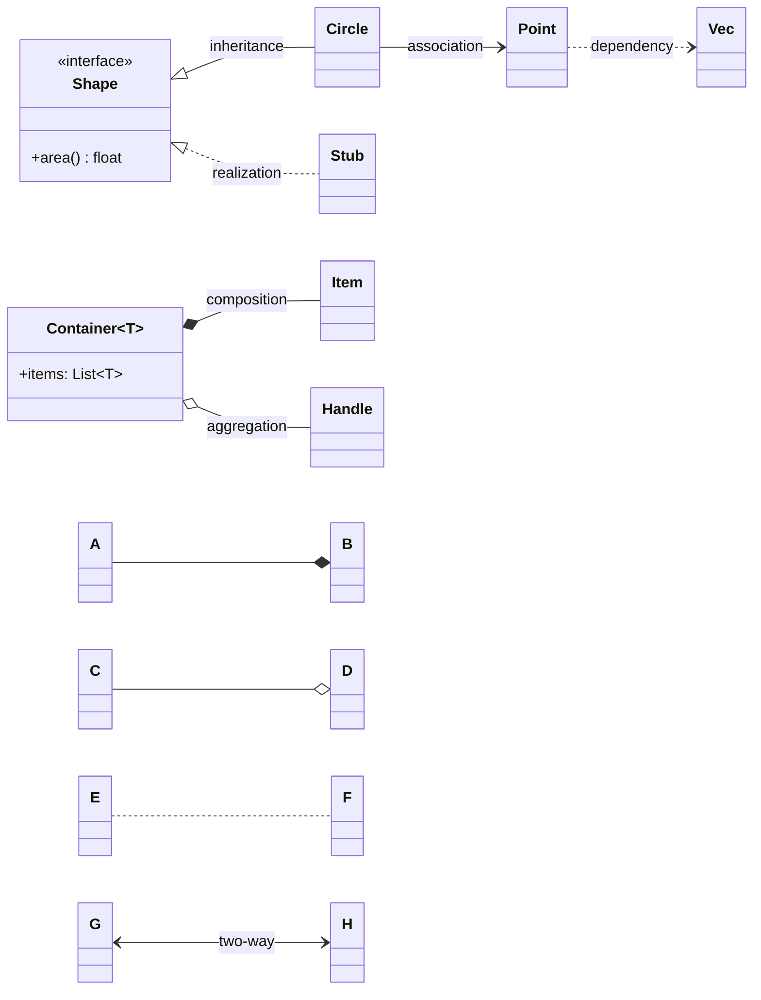
```mermaid
classDiagram
  direction LR
  class Shape {
    <<interface>>
    +area() float
  }
  class Container~T~ {
    +items: List~T~
  }
  Shape <|-- Circle : inheritance
  Shape <|.. Stub : realization
  Container *-- Item : composition
  Container o-- Handle : aggregation
  Circle --> Point : association
  Point ..> Vec : dependency
  A --* B
  C --o D
  E .. F
  G <--> H : two-way
```

### state-basic

States and transitions with start and end.

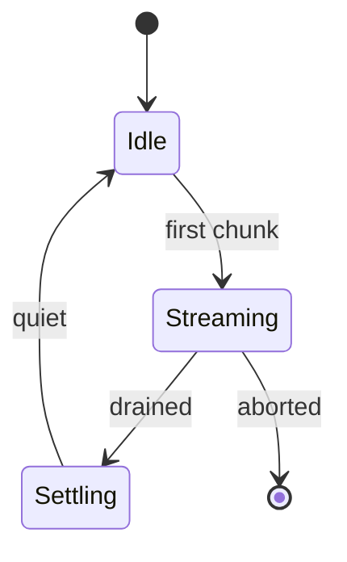
```mermaid
stateDiagram-v2
  [*] --> Idle
  Idle --> Streaming : first chunk
  Streaming --> Settling : drained
  Settling --> Idle : quiet
  Streaming --> [*] : aborted
```

### state-composite

Composite states, fork/join, choice and concurrency.

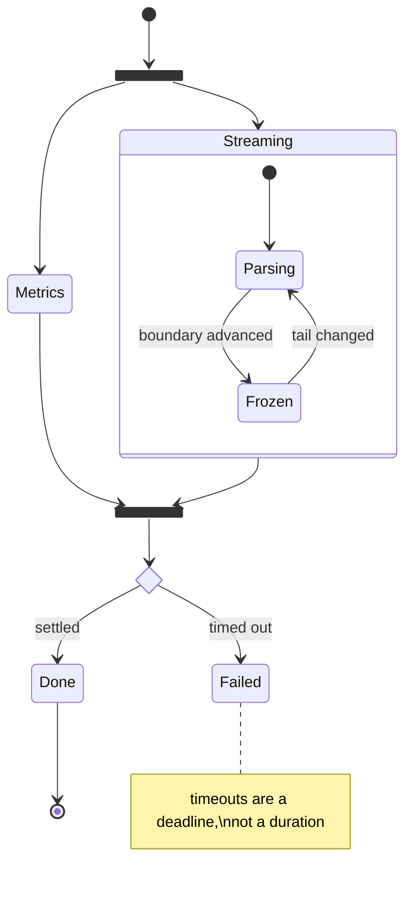
```mermaid
stateDiagram-v2
  state Streaming {
    [*] --> Parsing
    Parsing --> Frozen : boundary advanced
    Frozen --> Parsing : tail changed
  }
  state fork <<fork>>
  state join <<join>>
  state pick <<choice>>
  [*] --> fork
  fork --> Streaming
  fork --> Metrics
  Streaming --> join
  Metrics --> join
  join --> pick
  pick --> Done : settled
  pick --> Failed : timed out
  Done --> [*]
  note right of Failed : timeouts are a deadline,\nnot a duration
```

### er-basic

Entities, attributes, keys and every cardinality pair.

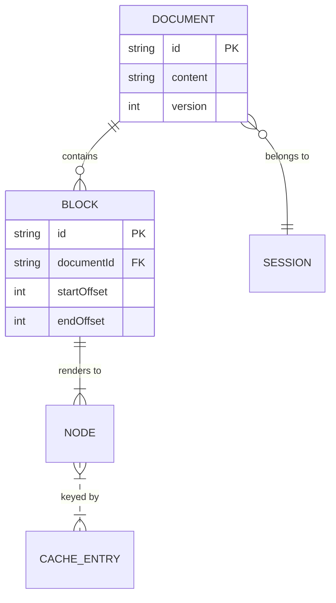
```mermaid
erDiagram
  DOCUMENT ||--o{ BLOCK : contains
  BLOCK ||--|{ NODE : "renders to"
  DOCUMENT }o--|| SESSION : "belongs to"
  NODE }|..|{ CACHE_ENTRY : "keyed by"
  DOCUMENT {
    string id PK
    string content
    int version
  }
  BLOCK {
    string id PK
    string documentId FK
    int startOffset
    int endOffset
  }
```

### gantt-basic

Sections, milestones, dependencies and excludes.

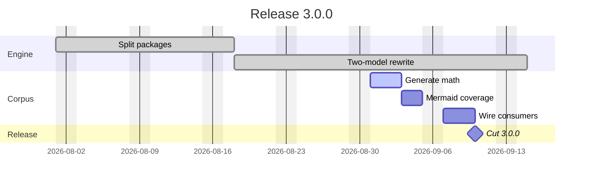
```mermaid
gantt
  title Release 3.0.0
  dateFormat YYYY-MM-DD
  excludes weekends
  section Engine
    Split packages      :done,    split, 2026-08-01, 12d
    Two-model rewrite   :done,    two,   after split, 20d
  section Corpus
    Generate math       :active,  math,  2026-08-31, 3d
    Mermaid coverage    :         merm,  after math, 2d
    Wire consumers      :         wire,  after merm, 3d
  section Release
    Cut 3.0.0           :milestone, rel, after wire, 0d
```

### pie-basic

The simplest renderer in mermaid — a useful low bound.

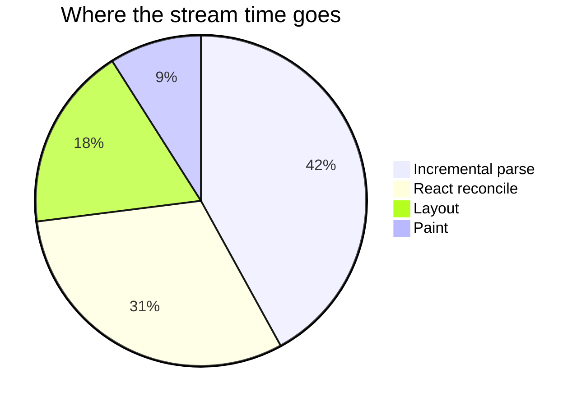
```mermaid
pie title Where the stream time goes
  "Incremental parse" : 42
  "React reconcile" : 31
  "Layout" : 18
  "Paint" : 9
```

### git-basic

Branches, merges, cherry-pick and tags.

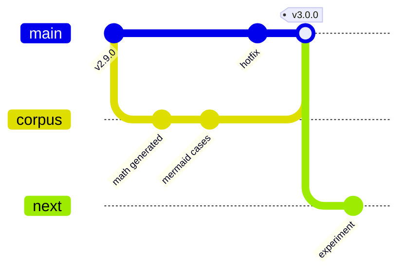
```mermaid
gitGraph
  commit id: "v2.9.0"
  branch corpus
  checkout corpus
  commit id: "math generated"
  commit id: "mermaid cases"
  checkout main
  commit id: "hotfix"
  merge corpus tag: "v3.0.0"
  branch next
  commit id: "experiment"
```

### journey-basic

The user-journey renderer — scored tasks per actor.

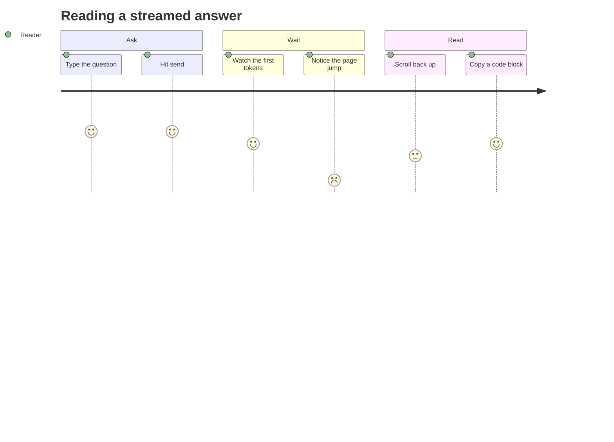
```mermaid
journey
  title Reading a streamed answer
  section Ask
    Type the question: 5: Reader
    Hit send: 5: Reader
  section Wait
    Watch the first tokens: 4: Reader
    Notice the page jump: 1: Reader
  section Read
    Scroll back up: 3: Reader
    Copy a code block: 4: Reader
```

### quadrant-basic

Quadrant axes and plotted points.

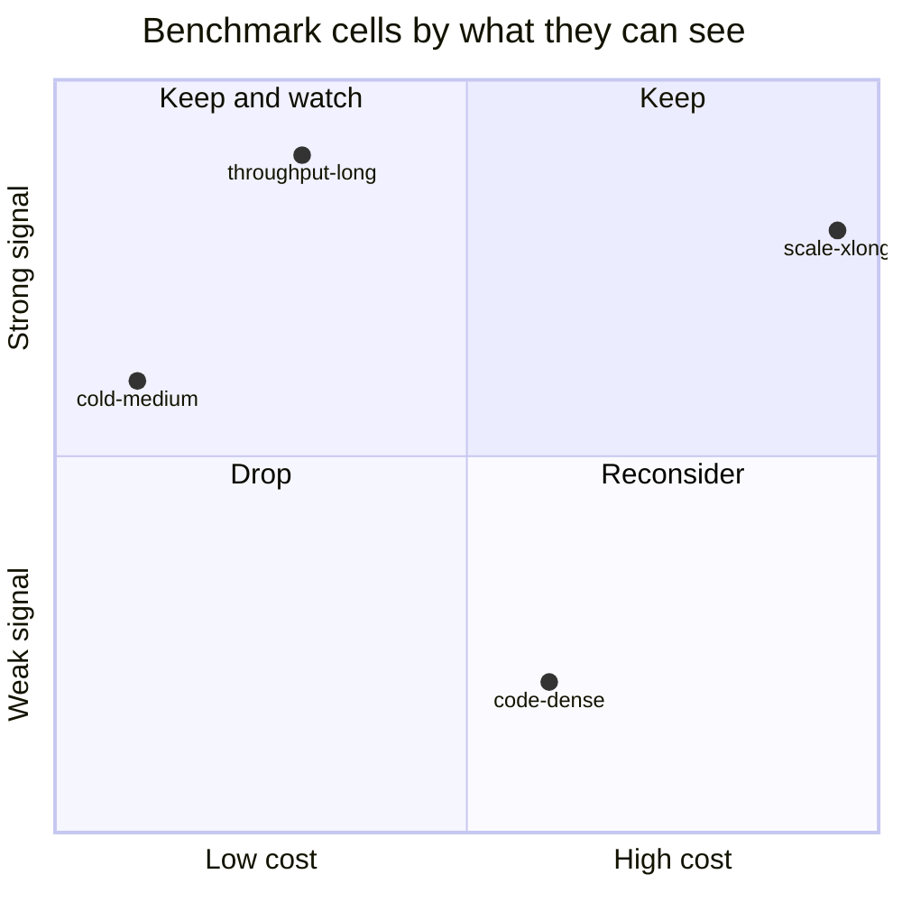
```mermaid
quadrantChart
  title Benchmark cells by what they can see
  x-axis Low cost --> High cost
  y-axis Weak signal --> Strong signal
  quadrant-1 Keep
  quadrant-2 Keep and watch
  quadrant-3 Drop
  quadrant-4 Reconsider
  "throughput-long": [0.3, 0.9]
  "scale-xlong": [0.95, 0.8]
  "code-dense": [0.6, 0.2]
  "cold-medium": [0.1, 0.6]
```

### requirement-basic

Requirements, elements and satisfy/verify relations.

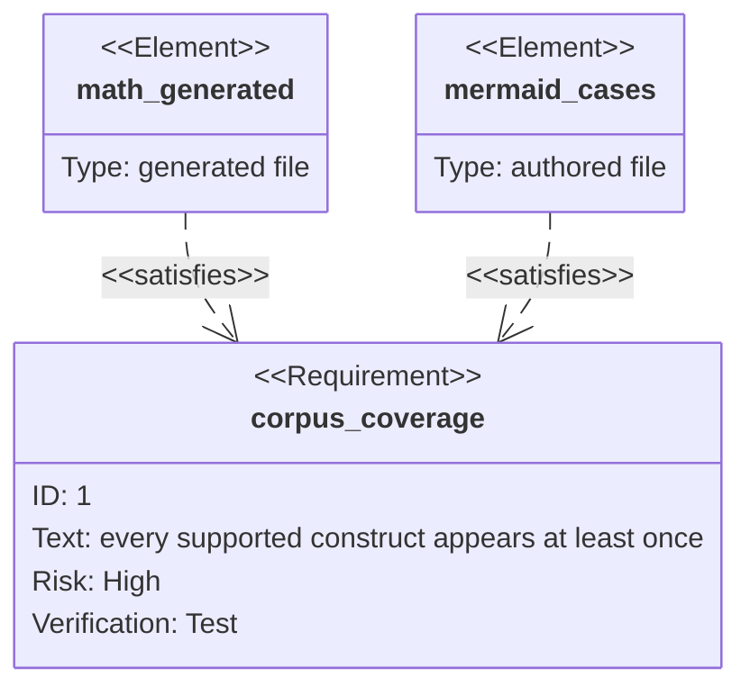
```mermaid
requirementDiagram
  requirement corpus_coverage {
    id: 1
    text: every supported construct appears at least once
    risk: high
    verifymethod: test
  }
  element math_generated {
    type: generated file
  }
  element mermaid_cases {
    type: authored file
  }
  math_generated - satisfies -> corpus_coverage
  mermaid_cases - satisfies -> corpus_coverage
```

### mindmap-basic

Indentation-driven nesting and per-node shapes.

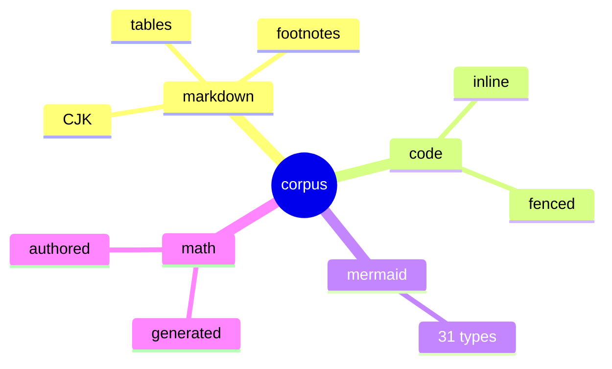
```mermaid
mindmap
  root((corpus))
    markdown
      tables
      footnotes
      CJK
    code
      inline
      fenced
    mermaid
      ::icon(fa fa-diagram)
      31 types
    math
      generated
      authored
```

### timeline-basic

Sections with multiple events per period.

```mermaid
timeline
  title Engine milestones
  section 2026 H1
    v1.8.0 : incremental parse on by default
    v2.0.0 : props v2
  section 2026 H2
    v2.3.0 : engine split into three packages
    v2.8.0 : two-model scanner
    v2.9.1 : F28 and the census
```

### sankey-basic

CSV-shaped input — a parser unlike every other type here.

```mermaid
sankey-beta

Chunks delivered,Parse,50283
Parse,Freeze scanner,50283
Freeze scanner,Reused prefix,48120
Freeze scanner,Reparsed tail,2163
Reused prefix,Commit,48120
Reparsed tail,Commit,2163
```

### xychart-basic

Bar and line series on shared axes.

```mermaid
xychart-beta
  title "Cost by delivery schedule"
  x-axis [2KB, 18KB, 148KB, 1.15MB]
  y-axis "Milliseconds" 0 --> 11000
  bar [18, 41, 229, 5009]
  line [69, 384, 10315, 10999]
```

### block-basic

Explicit column layout with spanning blocks.

```mermaid
block-beta
  columns 3
  doc["Document"]:3
  block:group1:2
    parse["Parse"]
    freeze["Freeze"]
  end
  render["Render"]
  space:3
  dom["DOM"]:3
  doc --> parse
  freeze --> render
  render --> dom
```

### packet-basic

Bit-range layout — fixed-grid rendering.

```mermaid
packet
  title Chunk frame
  0-7: "Version"
  8-15: "Flags"
  16-31: "Sequence"
  32-63: "Offset"
  64-95: "Length"
  96-127: "Checksum"
```

### kanban-basic

Columns of cards with metadata.

```mermaid
kanban
  Todo
    [Wire consumers]
    [Delete sealReleaseEnumerated]@{ ticket: 2.9.2 }
  In progress
    [Corpus rebuild]@{ assigned: 'corpus' }
  Done
    [Math generated layer]
    [Mermaid cases]
```

### architecture-basic

Groups, services, icons and edge junctions.

```mermaid
architecture-beta
  group workspace(cloud)[Workspace]
  service corpus(database)[Corpus] in workspace
  service engine(server)[Engine] in workspace
  service core(server)[Core] in workspace
  service bench(server)[Benchmarks] in workspace
  corpus:R --> L:engine
  corpus:B --> T:bench
  engine:R --> L:core
```

### radar-basic

Polar axes with multiple curves.

```mermaid
radar-beta
  title Corpus coverage by area
  axis markdown["Markdown"], code["Code"], math["Math"]
  axis mermaid["Mermaid"], cjk["CJK"], streaming["Streaming"]
  curve before["Before"]{20, 30, 15, 10, 0, 5}
  curve after["After"]{95, 90, 98, 100, 85, 70}
  max 100
  min 0
```

### treemap-basic

Nested weighted rectangles.

```mermaid
treemap-beta
"Corpus"
    "Math"
        "Symbols": 492
        "Functions": 272
        "Macros": 314
    "Mermaid"
        "Cases": 31
    "Code"
        "Languages": 30
    "Markdown"
        "Constructs": 40
```

### c4-basic

The C4 renderer — boundaries and typed relationships.

```mermaid
C4Context
  title Streaming a rendered answer
  Person(reader, "Reader", "Watches an answer arrive")
  System_Boundary(app, "Application") {
    Container(ui, "Renderer", "React", "Turns markdown into DOM")
    Container(engine, "Engine", "TypeScript", "Incremental parse")
  }
  System_Ext(model, "Model", "Emits tokens")
  Rel(reader, ui, "reads")
  Rel(ui, engine, "feeds chunks to")
  Rel(model, ui, "streams to", "SSE")
```

### venn-basic

Set intersections.

```mermaid
venn-beta
  title What each corpus consumer needs
  set benchmarks ["Benchmarks"]
  set tests ["Tests"]
  set stories ["Stories"]
  union benchmarks, tests ["Deterministic"]
```

### cynefin-basic

The cynefin domain renderer, with inter-domain transitions.

```mermaid
cynefin-beta
  title Where each failure lived
  clear "Missing package.json script"
  complicated "Freeze boundary off by a line"
  complex "Superlinearity that was update count"
  chaotic "Force-pushed tags re-firing releases"
  clear --> complicated
  complicated --> complex
  complex --> chaotic
```

### ishikawa-basic

Fishbone cause categories.

```mermaid
ishikawa
  title Why the corpus missed constructs
  Method
    "One family of scenarios"
    "Generated from 19 English words"
  Measurement
    "Coverage never asserted"
  Material
    "Five unrelated corpora"
  Machine
    "No parse gate"
```

### railroad-basic

Syntax-diagram rendering — a function-call grammar, not EBNF.

```mermaid
railroad-beta
  language = oneOrMore(terminal("a"));
  content = choice(terminal("code"), terminal("text"));
  fence = sequence(terminal("open"), optional(nonterminal("language")), terminal("close"));
```

### eventmodeling-basic

The event-modeling renderer — a numbered timeframe and one item.

```mermaid
eventmodeling
  tf 1
  cmd sendMessage "Send message"
```

### swimlane-basic

Lane-partitioned flow — flowchart layout with lanes, and the one diagram that reuses another's parser.

```mermaid
swimlane-beta
  subgraph Client
    ask[send prompt] --> read[render chunk]
  end
  subgraph Server
    open[open stream] --> fwd[forward chunk]
  end
  ask --> open
  fwd --> read
```

### treeview-basic

The file-tree renderer — paths, not indentation.

```mermaid
treeView-beta
  corpus[Corpus]
  corpus/src[src]
  corpus/scripts[scripts]
```

### wardley-basic

Value-chain positioning.

```mermaid
wardley-beta
  title Corpus as a capability
  anchor Reader [0.95, 0.60]
  component Rendered answer [0.85, 0.65]
  component Corpus [0.40, 0.30]
  component KaTeX [0.30, 0.85]
  Reader -> Rendered answer
  Rendered answer -> Corpus
  Corpus -> KaTeX
```

### info-basic

The smallest registered diagram — a version banner.

```mermaid
info
```

### flowchart-zh

Han glyphs at double advance width in every node and edge label.

```mermaid
flowchart TD
  A[接收请求] --> B{缓存是否命中}
  B -->|命中| C[从缓存返回]
  B -->|未命中| D[回源查询]
  C --> E[返回响应]
  D --> E
```

### flowchart-ja

Kanji, hiragana and katakana in one label — three sub-scripts, one font.

```mermaid
flowchart TD
  A[リクエスト受信] --> B{キャッシュは有効か}
  B -->|はい| C[キャッシュから応答]
  B -->|いいえ| D[上流へ問い合わせ]
  C --> E[レスポンス返却]
  D --> E
```

### flowchart-ko

Hangul syllable blocks, which wrap and measure unlike Han or kana.

```mermaid
flowchart TD
  A[요청 수신] --> B{캐시가 유효한가}
  B -->|예| C[캐시에서 응답]
  B -->|아니오| D[업스트림 조회]
  C --> E[응답 반환]
  D --> E
```

### flowchart-fullwidth-punctuation

Full-width brackets and punctuation INSIDE a label, where they are text and not syntax.

```mermaid
flowchart TD
  A[缓存（热）命中] --> B[【重要】写回上游]
  B --> C[「引用」与『强调』]
  C --> D[取得・変換〜出力]
  D --> E[状态：成功！继续？]
```

### flowchart-mixed-scripts

Four scripts in one chart plus explicit line breaks — the shape a real answer has.

```mermaid
flowchart LR
  A["解析 Markdown<br/>マークダウン解析<br/>마크다운 파싱"] --> B[渲染 KaTeX 公式]
  B --> C[输出 HTML]
  subgraph 上流サービス
    D[取得] --> E[변환]
  end
  C --> D
```

### sequence-cjk

CJK participants, aliases, messages, frames and a spanning note.

```mermaid
sequenceDiagram
  participant U as 用户
  participant G as ゲートウェイ
  participant S as 서버
  U->>G: 发起请求
  activate G
  G->>S: 転送する
  loop 每秒重试
    S-->>G: 처리 중
  end
  alt 成功
    S-->>G: 応答データ
    G-->>U: 返回结果
  else 失败
    S-->>G: エラー
    G-->>U: 오류 반환
  end
  deactivate G
  Note over U,S: 三种文字混排的时序图
```

### sequence-blocks-cjk

Opt / par / autonumber under CJK — frame labels that size the frame itself.

```mermaid
sequenceDiagram
  autonumber
  participant C as 客户端
  participant S as 服务端
  participant M as 모델
  C->>S: POST /chat
  activate S
  loop 每个分片
    S->>M: 下一个 token
    M-->>S: token
    alt token 是围栏开头
      S->>S: 缓冲到闭合为止
    else 普通 token
      S-->>C: 冲刷
    end
  end
  opt 客户端已断开
    S->>M: 取消生成
  end
  par 审计
    S->>S: 写日志
  and 指标
    S->>S: 上报计数
  end
  deactivate S
```

### sequence-notes-cjk

Participant box, self-message, a wrapped note and an async reply — free-floating CJK.

```mermaid
sequenceDiagram
  box rgb(240,240,255) 前台
    participant U as 用户
    participant C as 客户端
  end
  participant S as 서버
  Note over U,C: 读者正看着答案出现
  U->>C: 输入问题
  C->>C: 防抖
  Note right of C: 自己发给自己，<br/>没有对端
  C->>S: 发送
  S--)C: 流式开始
  Note over S: 虚线回复表示异步
```

### class-cjk

CJK class names, members and methods — the widest boxes in the set.

```mermaid
classDiagram
  class 用户 {
    +String 姓名
    +String 邮箱
    +登录() bool
    +注销()
  }
  class 管理员 {
    +封禁(用户) void
  }
  class 注文 {
    +金額 int
  }
  用户 <|-- 管理员
  用户 --> 注文 : 拥有
```

### class-relations-cjk

Every relation arrowhead plus generics and an annotation, all labelled in CJK.

```mermaid
classDiagram
  direction LR
  class 形状 {
    <<interface>>
    +面积() float
  }
  class 容器~T~ {
    +条目: List~T~
  }
  形状 <|-- 圆 : 继承
  形状 <|.. 桩 : 实现
  容器 *-- 条目 : 组合
  容器 o-- 句柄 : 聚合
  圆 --> 点 : 关联
  点 ..> 向量 : 依赖
  甲 --* 乙
  丙 --o 丁
  戊 .. 己
  庚 <--> 辛 : 双向
```

### state-cjk

CJK state names and transition labels, mixed across three scripts.

```mermaid
stateDiagram-v2
  [*] --> 空闲
  空闲 --> 处理中: 受信した
  处理中 --> 完了: 처리 성공
  处理中 --> 失败: 处理异常
  失败 --> 空闲: 重试
  完了 --> [*]
```

### state-composite-cjk

Composite states, fork/join/choice and a note — nested CJK inside a drawn container.

```mermaid
stateDiagram-v2
  state 流式中 {
    [*] --> 解析中
    解析中 --> 已冻结 : 边界前移
    已冻结 --> 解析中 : 尾部变化
  }
  state fork <<fork>>
  state join <<join>>
  state pick <<choice>>
  [*] --> fork
  fork --> 流式中
  fork --> 指标采集
  流式中 --> join
  指标采集 --> join
  join --> pick
  pick --> 完成 : 已静默
  pick --> 失败 : 超时
  完成 --> [*]
  note right of 失败 : 超时是一个期限，不是一段时长
```

### er-cjk

CJK entity names and relationship labels on the crow-foot renderer.

```mermaid
erDiagram
  用户 ||--o{ 订单 : 下单
  订单 ||--|{ 订单项 : 包含
  商品 ||--o{ 订单项 : 出现在
  用户 }|..|{ 优惠券 : 领取
```

### journey-cjk

CJK section, task and actor names — actors are rendered as a legend.

```mermaid
journey
  title 用户接入旅程
  section 注册
    填写表单: 5: 用户
    邮箱验证: 3: 用户, 系统
  section 首次使用
    阅读文档: 4: 用户
    发起调用: 5: 用户, 系统
```

### mindmap-cjk

Deep nesting where every level is a different script.

```mermaid
mindmap
  root((文字体系))
    中文
      简体字
      繁體字
    日本語
      漢字
      ひらがな
      カタカナ
    한국어
      한글
      한자
```

### gantt-cjk

CJK section and task names against an ASCII-delimited task line.

```mermaid
gantt
  title 语料体系排期
  dateFormat YYYY-MM-DD
  axisFormat %m-%d
  section 设计
  需求梳理 :done, a1, 2026-01-01, 5d
  方案评审 :active, a2, after a1, 3d
  section 实现
  生成器 :a3, after a2, 7d
  门禁接入 :a4, after a3, 4d
```

### pie-cjk

CJK slice labels, which pie requires quoted — as it does ASCII ones.

```mermaid
pie title 语料构成
  "中文用例" : 45
  "日本語ケース" : 30
  "한국어 사례" : 25
```

### timeline-cjk

CJK events, including two on one period.

```mermaid
timeline
  title 版本历程
  2026-01 : 首个版本
  2026-05 : 增量解析
  2026-08 : 引擎拆分 : 双模型重构
```

### quadrant-cjk

CJK axis ends, quadrant names and point labels — four label systems at once.

```mermaid
quadrantChart
  title 工作优先级
  x-axis 低成本 --> 高成本
  y-axis 低收益 --> 高收益
  quadrant-1 优先推进
  quadrant-2 排期规划
  quadrant-3 暂不投入
  quadrant-4 顺手完成
  语料体系: [0.3, 0.8]
  基准重做: [0.7, 0.4]
```

### block-cjk

CJK in quoted block labels, including a spanning block.

```mermaid
block-beta
  columns 3
  A["输入"] B["処理"] C["출력"]
  D["缓存层 · キャッシュ · 캐시"]:3
```

### gitgraph-cjk

CJK branch names, commit ids and tags — branch names must be quoted.

```mermaid
gitGraph
  commit id: "初版发布"
  branch "语料分支"
  checkout "语料分支"
  commit id: "数式コーパス"
  commit id: "머메이드 사례"
  checkout main
  commit id: "紧急修复"
  merge "语料分支" tag: "v3.0.0"
```

### requirement-cjk

CJK requirement and element names, quoted, with a CJK relationship.

```mermaid
requirementDiagram
  requirement "语料覆盖率" {
    id: 1
    text: "每个受支持的构造至少出现一次"
    risk: high
    verifymethod: test
  }
  element "数式生成层" {
    type: "生成文件"
  }
  "数式生成层" - satisfies -> "语料覆盖率"
```

### xychart-cjk

CJK axis categories and titles, all quoted — bare ones are rejected.

```mermaid
xychart-beta
  title "按交付方式的成本"
  x-axis ["二千字节", "十八千字节", "一百四十八千字节"]
  y-axis "毫秒" 0 --> 11000
  bar [18, 41, 229]
  line [69, 384, 10315]
```

### packet-cjk

CJK field names in a fixed-width bit layout — the tightest boxes in the set.

```mermaid
packet
  title 分片帧结构
  0-7: "版本"
  8-15: "标志位"
  16-31: "シーケンス"
  32-63: "오프셋"
```

### kanban-cjk

CJK column and card text, including a card with metadata.

```mermaid
kanban
  待办
    [接线五个消费者]
    [删除 sealReleaseEnumerated]@{ ticket: 2.9.2 }
  进行中
    [语料重建]@{ assigned: '语料' }
  已完成
    [数式生成层]
    [머메이드 사례]
```

### architecture-cjk

CJK service and group labels, quoted — the bare form is rejected here too.

```mermaid
architecture-beta
  group ws(cloud)["工作区"]
  service corpus(database)["语料"] in ws
  service engine(server)["エンジン"] in ws
  service bench(server)["벤치마크"] in ws
  corpus:R --> L:engine
  corpus:B --> T:bench
```

### radar-cjk

CJK axis and curve labels rotated around a polygon.

```mermaid
radar-beta
  title 各领域语料覆盖
  axis md["中文"], code["代码"], math["数式"]
  axis mm["図表"], cjk["한국어"], st["ストリーム"]
  curve before["改前"]{20, 30, 15, 10, 0, 5}
  curve after["改后"]{95, 90, 98, 100, 85, 70}
  max 100
  min 0
```

### treemap-cjk

CJK labels inside area-proportional boxes, where text can exceed its tile.

```mermaid
treemap-beta
"语料"
    "数式"
        "符号": 492
        "函数": 272
    "図表"
        "用例": 31
    "코드"
        "언어": 30
```

### c4-cjk

CJK across person, container, boundary and relationship labels.

```mermaid
C4Context
  title 流式渲染一个答案
  Person(reader, "读者", "看着答案逐步到达")
  System_Boundary(app, "应用") {
    Container(ui, "渲染器", "React", "把 Markdown 变成 DOM")
    Container(engine, "エンジン", "TypeScript", "増分解析")
  }
  System_Ext(model, "모델", "토큰을 생성")
  Rel(reader, ui, "阅读")
  Rel(ui, engine, "投喂分片")
  Rel(model, ui, "流式推送", "SSE")
```

### venn-cjk

CJK set labels, which are positioned inside overlapping circles.

```mermaid
venn-beta
  title 各消费者需要什么
  set bench ["基准"]
  set tests ["テスト"]
  set stories ["스토리"]
  union bench, tests ["确定性"]
```

### cynefin-cjk

CJK domain items, which wrap inside fixed quadrants.

```mermaid
cynefin-beta
  title 每类故障住在哪
  clear "缺少 package.json 脚本"
  complicated "冻结边界差一行"
  complex "被误判为超线性的更新次数"
  chaotic "强推 tag 重新触发发布"
  clear --> complicated
  complicated --> complex
```

### ishikawa-cjk

CJK causes on angled bones — the only type where labels are rotated.

```mermaid
ishikawa
  title 语料为何漏掉构造
  Method
    "只有一族场景"
    "由十九个英文词生成"
  Measurement
    "覆盖率从未被断言"
  Material
    "五份互不相干的语料"
  Machine
    "没有解析门禁"
```

### railroad-cjk

CJK terminals in a grammar diagram; rule names stay ASCII by necessity.

```mermaid
railroad-beta
  language = oneOrMore(terminal("中文"));
  content = choice(terminal("代码"), terminal("テキスト"), terminal("텍스트"));
  fence = sequence(terminal("开"), optional(nonterminal("language")), terminal("闭"));
```

### eventmodeling-cjk

A CJK command label on the event-modelling timeline.

```mermaid
eventmodeling
  tf 1
  cmd sendMessage "发送消息"
```

### swimlane-cjk

CJK lane titles and node labels — lane width is driven by the title.

```mermaid
swimlane-beta
  subgraph 客户端
    ask[发送提示] --> read[渲染分片]
  end
  subgraph 服务端
    open[开启流] --> fwd[转发分片]
  end
  ask --> open
  fwd --> read
```

### treeview-cjk

CJK node labels on ASCII paths — the path is structure, the label is text.

```mermaid
treeView-beta
  corpus[语料]
  corpus/src[源码]
  corpus/scripts[脚本]
```

### wardley-cjk

CJK component names, quoted, positioned on a value-chain map.

```mermaid
wardley-beta
  title 语料作为一项能力
  anchor "读者" [0.95, 0.60]
  component "渲染结果" [0.85, 0.65]
  component "语料" [0.40, 0.30]
  component "KaTeX" [0.30, 0.85]
  "读者" -> "渲染结果"
  "渲染结果" -> "语料"
  "语料" -> "KaTeX"
```
