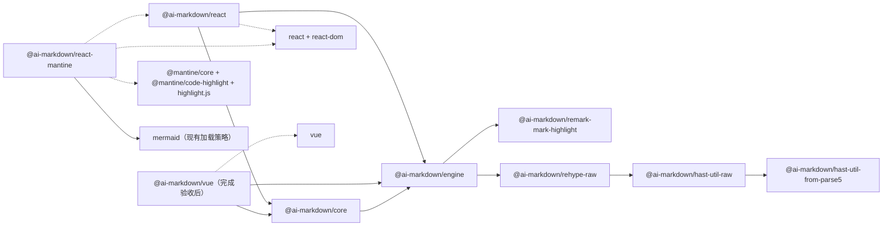

# ai-markdown 包名、依赖与发布方案（已确认）

状态：方案已于 2026-09-09 确认并完成包名、目录、分层和公共入口实施。旧库 v2.14.1 已发布并核验，GitHub 仓库已迁移到 `ai-markdown/ai-markdown`。主列车 `3.0.0-beta.1` 与独立插件 `1.0.1` 已上传 npm 并通过实际产物验证；GitHub 预发布已完成，维护者已明确接受四个 beta 包暂时保留 latest 标签。下文保留已确认的决策及迁移步骤，涉及旧目录的描述属于实施前背景。当前后续工作已进入 core/engine API 审查与 Vue 完整适配：Vue 源码迁入 packages/vue，工作区准备未发布的 3.0.0-beta.2 候选。文档站另行建设。

建议采用 **engine → 共享 core → 框架适配器 → 框架 UI 集成** 的职责分层。依赖图允许适配器直接依赖 engine：现有 React 和 Vue 原型确实使用它的插件组装、registry、扫描器等能力。共享 core 负责复用决策，不必转发整个 engine 来制造一条形式上单一的依赖链。

## 1. 已确认的六项决策

| 决策          | 我的推荐                                                                    | 主要取舍                                                                 |
| ------------- | --------------------------------------------------------------------------- | ------------------------------------------------------------------------ |
| 主包名        | `engine`、`core`、`react`、`vue`、`react-mantine`，统一在 `@ai-markdown` 下 | Mantine 名称标明 React；普通用户从框架包入手                             |
| 新版本起点    | 主列车先 `3.0.0-beta.1`，稳定后 `3.0.0`                                     | 延续旧库 2.x 的升级关系；新 scope 从 1.0.0 也可行，但更容易与旧 1.x 混淆 |
| 发布列车      | 首期 engine/core/react/react-mantine 同版本；Vue 正式加入后同行             | 初期依赖和验收简单，代价是少量没有源码变更的版本同步                     |
| 内部包依赖    | engine/core/适配器之间使用普通 dependencies，精确匹配列车版本               | 尽量减少共享算法版本错配；不要求应用手动安装 engine/core                 |
| Vue 首发定位  | 先作为 beta 验证对象；React 可先发布新 scope 的 beta                        | 不为等待完整 Vue 支持延迟名称和发布链路验证；正式支持状态必须标清楚      |
| 公共 API 承诺 | 先做导出白名单和签名审查，再发稳定 3.0                                      | 不能把当前私有 runtime 的 `export *` 原样变成长期公共承诺                |

以上六项已确认，作为本次迁移的实施约束。仓库迁移目标 `ai-markdown/ai-markdown` 和 npm scope `@ai-markdown` 已由你确认，不再作为待定问题。

## 2. 包名与目录映射

| 当前目录 / 包                                     | 推荐新目录 / 包                                            | 职责与用户                                                                                   | 首期状态       |
| ------------------------------------------------- | ---------------------------------------------------------- | -------------------------------------------------------------------------------------------- | -------------- |
| `packages/engine` / `@ai-react-markdown/engine`   | `packages/engine` / `@ai-markdown/engine`                  | Markdown 算法、管线、增量解析、registry、预处理和 URL 原语；主要给共享层及高级适配器作者使用 | 发布           |
| `packages/runtime` / 私有 runtime                 | `packages/core` / `@ai-markdown/core`                      | session、块规划、跨块准备与贡献、聚合脚注、smooth 协调；不含框架节点和 DOM                   | 发布前收口 API |
| `packages/core` / 旧 React core                   | `packages/react` / `@ai-markdown/react`                    | React 组件、hooks、上下文、节点缓存、最终转换、cursor DOM 和生命周期                         | 发布           |
| `packages/mantine` / `@ai-react-markdown/mantine` | `packages/react-mantine` / `@ai-markdown/react-mantine`    | React/Mantine 组件、排版、代码块与图表呈现                                                   | 发布           |
| `prototypes/vue` / 私有 Vue 原型                  | 原型先保留；验收后新增 `packages/vue` / `@ai-markdown/vue` | Vue VNode、响应式和生命周期、组件/slot、DOM 适配                                             | 目前保持私有   |
| `packages/remark-mark-highlight` / 旧插件         | 同目录 / `@ai-markdown/remark-mark-highlight`              | 独立 unified 插件，可脱离任何 UI 框架使用                                                    | 独立版本发布   |

推荐 `react-mantine` 而不是简单沿用 `mantine`，是因为这个集成包只能与 React 适配器一起使用。这样新用户看到名字就能理解依赖；未来若增加其他框架的 UI 集成，也能使用同样规则。

首期不新增 `@ai-markdown/runtime`、无 scope 的 `ai-markdown` 聚合安装包、通用 `ui` 包或 `adapters` 大包。当前抽象职责已有落点，增加这些包暂时没有独立的使用和版本价值。文档站、测试工具和 benchmark 都保持私有 workspace。

目录改名的操作顺序应先把旧 `packages/core` 移到 `packages/react`，再把 runtime 移到新的 core，避免同名目录碰撞。CSS、Storybook 导入和 tsconfig 路径随各自归属移动，不通过复制形成两份实现。

## 3. 推荐依赖图

图中的箭头表示“左侧包使用右侧依赖”，不是数据处理方向。实线是生产 dependencies，虚线是 peerDependencies。



为便于阅读，图没有穷尽 unified、类型包、访问器和 KaTeX 等现有依赖；迁移时应逐项保留和核验，而非因图中未列出就删除。现有 KaTeX optional peer 的语义暂不在这次改名中调整。

### 为什么适配器直接依赖 engine？

React 目前直接使用 `buildCoreRemarkPlugins`、`buildCoreRehypePlugins`、`createDefLabelScanner`、registry 类型、URL 解析等能力。Vue 原型也直接消费其中一部分。让这些 import 全部穿过共享 core，会增加大量无逻辑重导出，并模糊算法层与编排层的区别。

因此初期允许 `react → engine` 和 `vue → engine`，并要求它们显式声明真实依赖。之后若某部分准备逻辑本身确实应该进入 core，可以按代码职责迁移；不设“适配器绝对不得 import engine”的机械规则。

### 三个既有 fork 保持独立

组织现有的 `rehype-raw`、`hast-util-raw`、`hast-util-from-parse5` 已有对应的 `@ai-markdown` npm 包。2026-09-08 查询的 latest 分别为 `7.0.3`、`9.1.3`、`8.0.5`。前两层通过 npm alias 引用下一层 fork，不能仅按 dependencies 的键名查找 scope 来判断关系。

推荐继续保留独立仓库和上游对应的版本线。它们的发布节奏、上游同步和算法验证与 UI 框架包不同，不纳入主项目的 3.x 列车。主库的现有锁定关系在迁移时应保持。

## 4. dependencies、peers 与版本范围

以下 `V` 表示同一次主列车版本，例如 `3.0.0-beta.1`。

| 使用方        | 依赖                         | 仓库声明建议                | 发布后的要求                                              |
| ------------- | ---------------------------- | --------------------------- | --------------------------------------------------------- |
| core          | engine                       | `dependencies: workspace:*` | 精确 `V`                                                  |
| react         | core、engine                 | `dependencies: workspace:*` | 两者均精确 `V`                                            |
| vue（发布后） | core、engine                 | `dependencies: workspace:*` | 两者均精确 `V`                                            |
| react-mantine | react                        | peer + 开发 workspace 依赖  | beta 阶段保守匹配本次 `V`；稳定后使用 `^V`                |
| react         | react、react-dom             | peer + 开发依赖             | 第一版保留已验证的 React 19 范围                          |
| vue           | vue                          | peer + 开发依赖             | 以实际验证的 Vue 3.5 系列为初始范围，不直接承诺所有 Vue 3 |
| react-mantine | Mantine、highlight.js、React | 保留现有 peer 关系          | 不借包名迁移扩大主版本兼容声明                            |
| engine        | remark-mark-highlight        | `workspace:^`               | 插件独立 1.x 兼容范围                                     |
| engine        | rehype-raw fork              | 保留当前精确约束            | 目前为 `7.0.3`                                            |

pnpm 打包会把 `workspace:*`、`workspace:^` 转换为实际版本或兼容范围，因此必须检查 tarball 的 package.json，而不只看 workspace 源文件。[pnpm workspace 协议](https://pnpm.io/workspaces#workspace-protocol-workspace)

peer 用于要求应用提供匹配的宿主框架或配套框架适配器；不把 engine/core 都改成 peer，让普通用户为了安装 React 组件手工补齐内部层。[npm peerDependencies](https://docs.npmjs.com/cli/v11/configuring-npm/package-json#peerdependencies)

精确内部版本是初期降低组合复杂度的策略，不意味着在任何包管理器、任何嵌套安装中都能绝对保证只出现一份模块。我们不应把全局单例当作正确性的隐含条件；独立消费者测试仍要验证实际依赖解析。

### 一个建议的 React manifest 片段

此片段是讨论用示意，不是当前可发布文件：

```json
{
  "name": "@ai-markdown/react",
  "version": "3.0.0-beta.1",
  "dependencies": {
    "@ai-markdown/core": "workspace:*",
    "@ai-markdown/engine": "workspace:*"
  },
  "peerDependencies": {
    "react": "^19.0.0",
    "react-dom": "^19.0.0"
  }
}
```

实际 manifest 还要保留当前的 HAST/JSX 转换依赖、可选 KaTeX peer、exports、CSS、副作用声明及元数据。不能拿这个片段覆盖完整 package.json。

## 5. 新 core 对外公开什么

当前 runtime 的入口是 `export *`；其中一些函数是适配器契约，另一些只是实现辅助。新 core 主要面向适配器作者，普通应用仍通过 React/Vue 包使用组件，不需要直接操纵 session 和 registry。

建议在 beta 前列出白名单，并在稳定版前审核每个参数和返回值：

| 现有能力                                                | 建议处理                 | 必须写明的契约                                                    |
| ------------------------------------------------------- | ------------------------ | ----------------------------------------------------------------- |
| `createPipelineSession`                                 | 共享 core 支持的高级 API | 单消费者、reset、全量回退、SSR incremental=false、准备不发布      |
| `createBlockPlanner`、必要的块描述类型                  | 支持的高级 API           | 树身份、source 范围、key 不等于缓存有效性、部分遍历仍为 O(blocks) |
| `derivePhantomTargets`、`deriveCoordinationPolicy`      | 支持的纯准备函数         | 输入/输出快照只读、previous 仅为本消费者的身份提示                |
| `buildContributionChain`、`createContributionSession`   | 支持的准备/提交契约      | 贡献只在 commit 发布，失效字段覆盖完整，注册所有权由宿主负责      |
| `buildAggregateTree`、必要的克隆工具                    | 支持的高级 API           | registry body 的结构所有权、克隆不是任意数据深拷贝                |
| `createSmoothCoordinator`                               | 返回收窄后的支持接口     | register/release、sticky done、微任务清理和订阅；不暴露内部字段   |
| `deriveTailSignal`                                      | 支持的高级 API           | 返回源尾部事实，不提供 DOM 坐标或框架节点                         |
| HTML digest、部分扫描/规划辅助函数                      | 按实际适配器引用逐个决定 | 仅测试使用的 helper 不因当前 barrel 重导出就成为公共 API          |
| `SmoothCoordinatorInternal`、`_refcounts`、`_notify` 等 | 不作为支持 API 外露      | 测试通过源码内部接口访问，正式签名返回公开形态                    |

**删除一条 export 还不够。** 例如 `createSmoothCoordinator` 当前返回 `SmoothCoordinatorInternal`，贡献选项引用 `RegistryInternal`；即使从 barrel 删掉这些 type，公开函数签名仍可能携带内部字段。应同时收窄返回值、贡献写入能力接口和声明引用，避免把实现容器变成支持契约。

engine 也需要同样检查：其入口目前导出 scenarios fixture 和一些测试/遥测辅助。跨包生产调用所需的算法 API必须明确保留；只有测试使用的内容改从源码测试接口获取。稳定版本不应继续写“所有 engine 导出都不保证稳定”，同时又要求第三方适配器使用它们。

首期建议保留一个清晰的 core 根入口；若白名单整理证明存在值得独立维护的消费者群体，再增加子入口，不先创建大量 `/internal`、`/adapter`、`/utils` 路径。React 的既有 `/plugins` 和 CSS 子路径则有真实用户，应保留对应迁移路径。

## 6. 发布和构建策略

### 主列车与独立版本

主列车首先包含 engine/core/react/react-mantine。Vue 在满足正式适配验收并准备公开时加入；它目前 `private: true`，不为“多框架”宣传而提前发布不完整包。remark-mark-highlight 保持独立 1.x 线，三个 fork 继续各自维护。

推荐从 `3.0.0-beta.1` 开始验证新包。稳定 3.0.0 的承诺由测试和文档范围决定，不因旧 React 库已经成熟就自动推导出新 core/Vue API 稳定。备选是新 scope 从 1.0.0 起步；如果你更看重新品牌独立计数，可以统一替换列车版本，架构方案不受影响。

使用明确的 beta dist-tag，避免预发布覆盖稳定入口。npm 的 dist-tag 与 semver 版本是不同概念，发布脚本应分别验证。[npm dist-tags](https://docs.npmjs.com/adding-dist-tags-to-packages)

### 打包策略

- 新 React/Vue 包将共享 core 和 engine 保持为外部包依赖，不再内联私有 runtime。当前 `core/tsup.config.ts` 的 runtime alias/noExternal 和 DTS resolve 规则必须成套改写。
- core 本身将 engine 保持外部依赖。框架依赖保持 external；根入口不能意外打入 React/Vue。
- 暂时保留现有 ESM/CJS、开发/生产条件及 `.d.ts`/`.d.cts` 支持，不把模块格式精简混入命名迁移。
- React 入口的 `use client`、CSS sideEffects 和 typography 子路径保持可验证；Vue/core 不能继承 React 专属指令。
- 现有 CJS ESM 插件适配及第三方 LICENSE 收集继续保留。这些是分发正确性工作，不是改名时应清理掉的遗留代码。

### 发布顺序

独立插件所需版本存在 → engine → core → react → react-mantine；Vue 可在其验收完成后发布。实际 CI 可以按 workspace 依赖拓扑执行，但每一步仍要确认依赖版本已可解析。首次建立新包、配置 OIDC、后续自动发布分开演练。

旧 2.14.1 已发布并完成 npm 实包核验，仓库已按顺序转移完成。新 scope 的 trusted publisher 要绑定新的组织、仓库及 workflow；当前用户已授权的仓库转移不等于所有 npm 新包设置已完成。[npm trusted publishing](https://docs.npmjs.com/trusted-publishers/)

## 7. 对现有用户的迁移体验

推荐第一版尽量保持 React/Mantine 符号名称和调用形态，只改变包入口：

| 旧写法                                          | 建议新写法                                 |
| ----------------------------------------------- | ------------------------------------------ |
| `@ai-react-markdown/core`                       | `@ai-markdown/react`                       |
| `@ai-react-markdown/core/plugins`               | `@ai-markdown/react/plugins`               |
| `@ai-react-markdown/core/typography/<name>.css` | `@ai-markdown/react/typography/<name>.css` |
| `@ai-react-markdown/mantine`                    | `@ai-markdown/react-mantine`               |
| `@ai-react-markdown/mantine/styles.css`         | `@ai-markdown/react-mantine/styles.css`    |
| `@ai-react-markdown/remark-mark-highlight`      | `@ai-markdown/remark-mark-highlight`       |

最容易混淆的是：**旧 core 迁到 react，不是新 core。** 文档、迁移脚本及报错示例都要优先突出这一点。

先做兼容的导出转移，不同时给 `AIMarkdown`、hooks 和配置字段重命名。旧包和标签继续可安装；新稳定包和迁移指南准备好后，再决定是否给旧 npm 包增加迁移提示。不要用 npm alias/空壳转发包把两个时期的依赖关系隐式拼起来。

迁移说明至少包括普通 React、Mantine、自定义 typography、plugins 子路径、预处理器、跨块引用和 SSR 七类示例。每类示例以真实打包安装结果进行类型检查，而不是仅做文本替换检查。

## 8. 实施分段与验收

| 阶段                  | 交付                                                  | 验收依据                                                 |
| --------------------- | ----------------------------------------------------- | -------------------------------------------------------- |
| A：已完成             | 2.14.1 发布核验；仓库转移并改名                       | 同一 GitHub repo id、标签/Release 保留；本地 origin 更新 |
| B：已确认本方案       | 包名、版本、依赖、API 入口决策                        | 六项决策已达成一致                                       |
| C：仅迁移身份和构建   | 目录、包名、import、manifest、构建/版本脚本           | 所有新包 tarball 无旧内部包依赖；React 迁移示例通过      |
| D：新 API 收口及 beta | 明确公共导出和签名；新 scope 发布链路                 | 分发消费、宿主框架外置、私有包不泄漏、beta 安装成功      |
| E：Vue 浏览器适配     | VNode/placeholder、URL、SSR hydration、扩展和流式行为 | 三条完整浏览器验收路径，见实施矩阵                       |
| F：稳定版与文档站     | 稳定包、版本化文档和迁移指南                          | 声明稳定范围与实际支持一致；完整发布门槛通过             |

命名迁移、API 变化和 Vue 功能分别提交、分别审查。若新发现要求改动解析算法，按现有规定增加针对性验证和 fresh soak；不能以“只是多框架”省略算法验收。

## 9. 本次检查的事实与限制

- `gh` 已核实组织 `ai-markdown` 存在，AIEPhoenix 为组织管理员，新仓库具备管理员权限。仓库转移已在 2.14.1 完整发布核验之后完成，标签和 Release 保留，本地 origin 已更新。
- npm scope 注册来自你的确认。2026-09-08 对 engine/core/react/react-mantine/vue/remark-mark-highlight 六个目标包的公开元数据请求均返回 HTTP 404。404 不是对命名权或首发权限的保证，发布前需再次检查。
- 三个既有 fork 的公开 manifest 已核对；其 alias 链见上文。主项目原来已经使用它们，不要在全局替换时把它们当成新迁移目标。
- 迁移前基线为 152 个测试文件、1,982 个测试。当前 API/Vue 候选已通过 154 个测试文件、1,990 个测试、React Chromium GC 回归和 Vue 浏览器验收；Vue 3.5.0 的实际打包 SSR/类型消费也已验证。当前候选尚未执行新的 release soak 或发布。
- 本方案已进入实施；包名、目录、依赖、导出和 workflow 的实际变更以迁移提交为准。

后续文件与文档站页面归属草案见 [实施和文档站准备矩阵](./ai-markdown-migration-worklist.md)。当前实现的边界说明见 [框架迁移指南](../framework-transition.md) 与 [core README](../../packages/core/README.md)。
