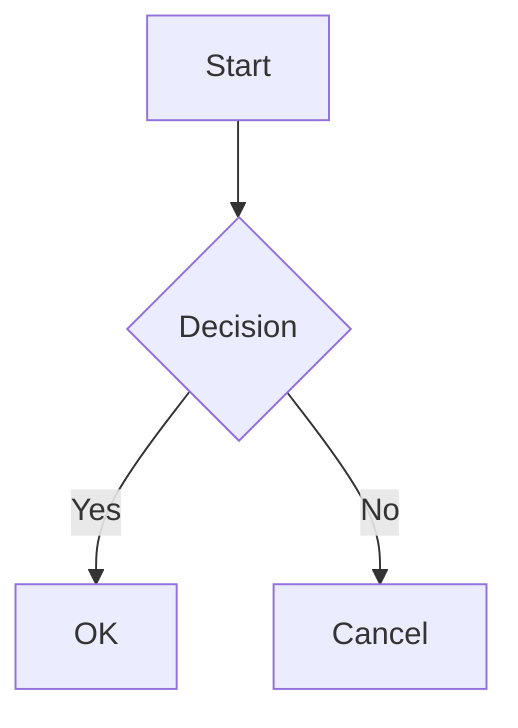

# @ai-react-markdown/mantine

Mantine UI integration for `@ai-react-markdown/core`. Provides a drop-in `<MantineAIMarkdown>` component that renders AI-generated markdown with Mantine-themed typography, syntax-highlighted code blocks, mermaid diagram support, and automatic color scheme detection.

## What It Adds on Top of Core

- **Mantine typography** -- uses Mantine's `<Typography>` component for consistent theming
- **Code highlighting** -- renders code blocks with `@mantine/code-highlight` (powered by highlight.js), including tabbed views with language labels, expand/collapse, and optional auto-detection for unlabeled blocks
- **Mermaid diagrams** -- `mermaid` code blocks are rendered as interactive SVG diagrams with dark/light theme support, toggle to source view, copy, and open-in-new-window
- **Automatic color scheme** -- detects Mantine's computed color scheme (`useComputedColorScheme`) and passes it to the core renderer automatically
- **Mantine-scoped CSS** -- extra styles wrapper overrides Mantine spacing/font-size custom properties to use relative `em` units, ensuring consistent scaling at any base font size

All core features (GFM, LaTeX math, CJK support, streaming, metadata context, content preprocessors, custom components) are inherited from `@ai-react-markdown/core`.

## Installation

```bash
# npm
npm install @ai-react-markdown/mantine @ai-react-markdown/core

# pnpm
pnpm add @ai-react-markdown/mantine @ai-react-markdown/core

# yarn
yarn add @ai-react-markdown/mantine @ai-react-markdown/core
```

### Peer Dependencies

```json
{
  "react": ">=19",
  "react-dom": ">=19",
  "@ai-react-markdown/core": "^1.0.2",
  "@mantine/core": "^8.3.17",
  "@mantine/code-highlight": "^8.3.17",
  "highlight.js": "^11.11.1"
}
```

### CSS Dependencies

Import the required stylesheets in your application entry point:

```tsx
// Mantine core styles (required)
import '@mantine/core/styles.css';

// Mantine code highlight styles (required for code blocks)
import '@mantine/code-highlight/styles.css';

// Mantine AI Markdown styles (required for extra styles and mermaid)
import '@ai-react-markdown/mantine/styles.css';

// KaTeX styles (required for LaTeX math rendering)
import 'katex/dist/katex.min.css';
```

## Quick Start

```tsx
import { MantineProvider } from '@mantine/core';
import { CodeHighlightAdapterProvider, createHighlightJsAdapter } from '@mantine/code-highlight';
import hljs from 'highlight.js';
import MantineAIMarkdown from '@ai-react-markdown/mantine';

const highlightJsAdapter = createHighlightJsAdapter(hljs);

function App() {
  return (
    <MantineProvider>
      <CodeHighlightAdapterProvider adapter={highlightJsAdapter}>
        <MantineAIMarkdown content="Hello **world**! Math: $E = mc^2$" />
      </CodeHighlightAdapterProvider>
    </MantineProvider>
  );
}
```

### Streaming Example

```tsx
function StreamingChat({ content, isStreaming }: { content: string; isStreaming: boolean }) {
  return <MantineAIMarkdown content={content} streaming={isStreaming} />;
}
```

## Props API Reference

### `MantineAIMarkdownProps<TConfig, TRenderData>`

Extends `AIMarkdownProps` from the core package. All core props are supported; listed below are the inherited props with Mantine-specific default overrides:

| Prop                   | Type                             | Default                                | Description                                                          |
| ---------------------- | -------------------------------- | -------------------------------------- | -------------------------------------------------------------------- |
| `content`              | `string`                         | **(required)**                         | Raw markdown content to render.                                      |
| `streaming`            | `boolean`                        | `false`                                | Whether content is actively being streamed.                          |
| `fontSize`             | `number \| string`               | `'0.875rem'`                           | Base font size. Numbers are treated as pixels.                       |
| `variant`              | `AIMarkdownVariant`              | `'default'`                            | Typography variant name.                                             |
| `colorScheme`          | `AIMarkdownColorScheme`          | Auto-detected                          | Color scheme. Defaults to Mantine's computed color scheme.           |
| `config`               | `PartialDeep<TConfig>`           | `undefined`                            | Partial render config, deep-merged with defaults.                    |
| `defaultConfig`        | `TConfig`                        | `defaultMantineAIMarkdownRenderConfig` | Base config.                                                         |
| `metadata`             | `TRenderData`                    | `undefined`                            | Arbitrary data for custom components via dedicated context.          |
| `contentPreprocessors` | `AIMDContentPreprocessor[]`      | `[]`                                   | Additional preprocessors after the built-in LaTeX preprocessor.      |
| `customComponents`     | `AIMarkdownCustomComponents`     | Mantine defaults                       | Component overrides, merged with Mantine's built-in `<pre>` handler. |
| `Typography`           | `AIMarkdownTypographyComponent`  | `MantineAIMarkdownTypography`          | Typography wrapper.                                                  |
| `ExtraStyles`          | `AIMarkdownExtraStylesComponent` | `MantineAIMDefaultExtraStyles`         | Extra style wrapper.                                                 |

## Mantine-Specific Configuration

The Mantine package extends the core `AIMarkdownRenderConfig` with additional options:

### `MantineAIMarkdownRenderConfig`

Inherits all core config fields plus:

| Field                                 | Type      | Default | Description                                                         |
| ------------------------------------- | --------- | ------- | ------------------------------------------------------------------- |
| `codeBlock.defaultExpanded`           | `boolean` | `true`  | Whether code blocks start expanded.                                 |
| `codeBlock.autoDetectUnknownLanguage` | `boolean` | `false` | Use highlight.js to auto-detect language for unlabeled code blocks. |

### Example: Collapsed Code Blocks

```tsx
<MantineAIMarkdown
  content={markdown}
  config={{
    codeBlock: { defaultExpanded: false },
  }}
/>
```

## Hooks

### `useMantineAIMarkdownRenderState<TConfig>()`

Typed wrapper around the core `useAIMarkdownRenderState` hook, defaulting to `MantineAIMarkdownRenderConfig`. Accepts an optional generic parameter for further extension.

```tsx
import { useMantineAIMarkdownRenderState } from '@ai-react-markdown/mantine';

function MyCodeBlock() {
  const { config, streaming, colorScheme } = useMantineAIMarkdownRenderState();
  const isExpanded = config.codeBlock.defaultExpanded;
  // ...
}
```

### `useMantineAIMarkdownMetadata<TMetadata>()`

Typed wrapper around the core `useAIMarkdownMetadata` hook, defaulting to `MantineAIMarkdownMetadata`. Accepts an optional generic parameter for further extension. Metadata lives in a separate React context from render state, so metadata updates do not cause re-renders in components that only consume render state.

```tsx
import { useMantineAIMarkdownMetadata } from '@ai-react-markdown/mantine';

function MyComponent() {
  const metadata = useMantineAIMarkdownMetadata();
  // Access metadata fields
}
```

## Code Highlighting Setup

Code highlighting requires a `CodeHighlightAdapterProvider` wrapping your component tree. This is a Mantine requirement -- the adapter bridges highlight.js into Mantine's code highlight components.

```tsx
import { CodeHighlightAdapterProvider, createHighlightJsAdapter } from '@mantine/code-highlight';
import hljs from 'highlight.js';

const highlightJsAdapter = createHighlightJsAdapter(hljs);

function App() {
  return (
    <CodeHighlightAdapterProvider adapter={highlightJsAdapter}>
      {/* MantineAIMarkdown components can be rendered anywhere below */}
    </CodeHighlightAdapterProvider>
  );
}
```

### Language Auto-Detection

By default, code blocks without an explicit language annotation render as plaintext. Enable auto-detection via config:

```tsx
<MantineAIMarkdown content={markdown} config={{ codeBlock: { autoDetectUnknownLanguage: true } }} />
```

This uses `highlight.js`'s `highlightAuto` to guess the language. Results may vary for short or ambiguous snippets.

## Mermaid Diagram Support

Fenced code blocks with the `mermaid` language identifier are automatically rendered as interactive SVG diagrams:

````markdown

````

Features:

- Automatic dark/light theme switching based on Mantine's color scheme
- Toggle between rendered diagram and raw source code
- Copy button for the mermaid source
- Click the rendered diagram to open the SVG in a new window
- Chart type label displayed in the header
- Graceful fallback to source code display on parse errors

The `mermaid` library is a direct dependency of this package -- no additional installation is needed.

## Color Scheme Integration

`MantineAIMarkdown` automatically detects Mantine's computed color scheme using `useComputedColorScheme('light')`. You can override this by passing an explicit `colorScheme` prop:

```tsx
// Automatic (default) -- follows Mantine's color scheme
<MantineAIMarkdown content={markdown} />

// Explicit override
<MantineAIMarkdown content={markdown} colorScheme="dark" />
```

The color scheme is passed to:

- The core `<AIMarkdown>` component for typography theming
- Mermaid diagram rendering (dark/base theme selection)
- The extra styles wrapper for color-aware CSS

## Custom Components

Custom component overrides are merged with the Mantine defaults. Your overrides take precedence:

```tsx
import MantineAIMarkdown from '@ai-react-markdown/mantine';
import type { AIMarkdownCustomComponents } from '@ai-react-markdown/core';

const customComponents: AIMarkdownCustomComponents = {
  a: ({ href, children }) => (
    <a href={href} target="_blank" rel="noopener noreferrer">
      {children}
    </a>
  ),
};

<MantineAIMarkdown content={markdown} customComponents={customComponents} />;
```

To override the default `<pre>` handler (and lose built-in code highlighting and mermaid support), include `pre` in your custom components.

## Exported API

### Default Export

- `MantineAIMarkdown` -- the main component (memoized)

### Components

- `MantineAIMarkdownTypography` -- Mantine-themed typography wrapper
- `MantineAIMDefaultExtraStyles` -- default extra styles wrapper with Mantine CSS scoping

### Types

- `MantineAIMarkdownProps`
- `MantineAIMarkdownRenderConfig`
- `MantineAIMarkdownMetadata`

### Constants

- `defaultMantineAIMarkdownRenderConfig` -- default Mantine render config (frozen)

### Hooks

- `useMantineAIMarkdownRenderState<TConfig>()` -- typed render state access
- `useMantineAIMarkdownMetadata<TMetadata>()` -- typed metadata access

## Core Package

For base features, configuration options, content preprocessors, TypeScript generics, and architecture details, see the [`@ai-react-markdown/core` README](../core/README.md).

## License

MIT
