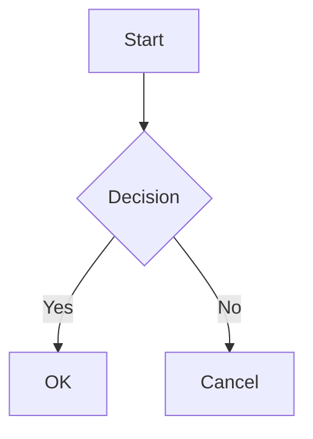

# @ai-react-markdown/mantine

[](https://www.npmjs.com/package/@ai-react-markdown/mantine)
[](https://www.npmjs.com/package/@ai-react-markdown/mantine)
[](../../LICENSE)

Mantine UI integration for `@ai-react-markdown/core`. Provides a drop-in `<MantineAIMarkdown>` component that renders AI-generated markdown with Mantine-themed typography, syntax-highlighted code blocks, Mermaid diagrams, and automatic color scheme detection.

## What It Adds on Top of Core

- **Mantine typography** -- markdown content is wrapped in Mantine's `<Typography>` so it inherits the active theme's font family, line height, and color tokens
- **Syntax highlighting** -- code blocks render via `@mantine/code-highlight` (powered by highlight.js), with language-labelled tabs, expand/collapse, and optional auto-detection for unlabelled blocks
- **Mermaid diagrams** -- fenced `mermaid` code blocks render as interactive SVG diagrams with dark/light theme support, source toggle, copy, and open-in-new-window
- **JSON pretty-print** -- fenced `json` code blocks are deep-parsed (nested JSON-encoded strings are expanded) and re-serialized with 2-space indent before highlighting
- **Automatic color scheme** -- detects Mantine's computed color scheme (`useComputedColorScheme`) and forwards it to the core renderer when no explicit `colorScheme` prop is supplied
- **Mantine-scoped CSS** -- extra-styles wrapper overrides Mantine spacing/font-size custom properties to use relative `em` units, giving consistent scaling at any base font size

All core features (GFM, LaTeX math, CJK support, streaming, metadata context, content preprocessors, custom components, cross-chunk coordination via `<AIMarkdownDocuments>`) are inherited unchanged from `@ai-react-markdown/core`. See the [core README](../core/README.md) for the base API.

## Installation

```bash
# npm
npm install @ai-react-markdown/mantine @ai-react-markdown/core

# pnpm
pnpm add @ai-react-markdown/mantine @ai-react-markdown/core

# yarn
yarn add @ai-react-markdown/mantine @ai-react-markdown/core
```

### Peer Dependencies

```json
{
  "react": ">=19",
  "react-dom": ">=19",
  "@ai-react-markdown/core": "^1.4.7",
  "@mantine/core": "^8.3.17",
  "@mantine/code-highlight": "^8.3.17",
  "highlight.js": "^11.11.1"
}
```

### CSS Dependencies

Import the required stylesheets in your application entry point:

```tsx
// Mantine core styles (required)
import '@mantine/core/styles.css';

// Mantine code highlight styles (required for code blocks)
import '@mantine/code-highlight/styles.css';

// Mantine AI Markdown styles (required for extra styles + Mermaid)
import '@ai-react-markdown/mantine/styles.css';

// KaTeX styles (required for LaTeX math rendering)
import 'katex/dist/katex.min.css';
```

## Quick Start

```tsx
import { MantineProvider } from '@mantine/core';
import { CodeHighlightAdapterProvider, createHighlightJsAdapter } from '@mantine/code-highlight';
import hljs from 'highlight.js';
import MantineAIMarkdown from '@ai-react-markdown/mantine';

const highlightJsAdapter = createHighlightJsAdapter(hljs);

function App() {
  return (
    <MantineProvider>
      <CodeHighlightAdapterProvider adapter={highlightJsAdapter}>
        <MantineAIMarkdown content="Hello **world**! Math: $E = mc^2$" />
      </CodeHighlightAdapterProvider>
    </MantineProvider>
  );
}
```

### Streaming Example

```tsx
function StreamingChat({ content, isStreaming }: { content: string; isStreaming: boolean }) {
  return <MantineAIMarkdown content={content} streaming={isStreaming} />;
}
```

## Props API Reference

### `MantineAIMarkdownProps<TConfig, TRenderData>`

`MantineAIMarkdownProps` extends `AIMarkdownProps` -- every core prop is supported. The table below lists each prop with its Mantine-specific default override (props not listed here inherit core defaults unchanged).

| Prop                   | Type                             | Default                                | Description                                                                                                                                                                  |
| ---------------------- | -------------------------------- | -------------------------------------- | ---------------------------------------------------------------------------------------------------------------------------------------------------------------------------- |
| `content`              | `string`                         | **(required)**                         | Raw markdown content to render.                                                                                                                                              |
| `streaming`            | `boolean`                        | `false`                                | Whether content is actively being streamed.                                                                                                                                  |
| `fontSize`             | `number \| string`               | `'0.9375rem'`                          | Base font size. Numbers are treated as pixels. Inherited from core.                                                                                                          |
| `variant`              | `AIMarkdownVariant`              | `'default'`                            | Typography variant name.                                                                                                                                                     |
| `colorScheme`          | `AIMarkdownColorScheme`          | Auto-detected                          | Color scheme. When omitted, defaults to Mantine's computed color scheme via `useComputedColorScheme('light')`.                                                               |
| `config`               | `PartialDeep<TConfig>`           | `undefined`                            | Partial render config, deep-merged with `defaultConfig`.                                                                                                                     |
| `defaultConfig`        | `TConfig`                        | `defaultMantineAIMarkdownRenderConfig` | Base config to merge against. Already extends `defaultAIMarkdownRenderConfig` with Mantine's `codeBlock.*` defaults.                                                         |
| `metadata`             | `TRenderData`                    | `undefined`                            | Arbitrary data for custom components via dedicated context.                                                                                                                  |
| `contentPreprocessors` | `AIMDContentPreprocessor[]`      | `[]`                                   | Additional preprocessors run after the built-in LaTeX preprocessor.                                                                                                          |
| `customComponents`     | `AIMarkdownCustomComponents`     | Mantine defaults                       | Component overrides, merged with Mantine's built-in `<pre>` handler. Caller overrides take precedence -- including `pre` here disables Mantine's code-block features.        |
| `Typography`           | `AIMarkdownTypographyComponent`  | `MantineAIMarkdownTypography`          | Typography wrapper component.                                                                                                                                                |
| `ExtraStyles`          | `AIMarkdownExtraStylesComponent` | `MantineAIMDefaultExtraStyles`         | Extra style wrapper rendered between typography and content.                                                                                                                 |
| `documentId`           | `string`                         | auto via `useId()`                     | Stable id namespace for clobberable attributes. See the [core docs](../core/README.md#aimarkdownpropstconfig-trenderdata) for full semantics. Required for cross-chunk mode. |

## Configuration

The Mantine package extends the core `AIMarkdownRenderConfig` with code-block options. All core config fields (`extraSyntaxSupported`, `displayOptimizeAbilities`, `blockMemoEnabled`, `preserveOrphanReferences`) remain available unchanged.

### `MantineAIMarkdownRenderConfig`

Inherits all core config fields plus:

| Field                                 | Type      | Default | Description                                                                                                                 |
| ------------------------------------- | --------- | ------- | --------------------------------------------------------------------------------------------------------------------------- |
| `codeBlock.defaultExpanded`           | `boolean` | `true`  | Whether code blocks start in their expanded state. When `false`, long blocks are collapsed with an expand button.           |
| `codeBlock.autoDetectUnknownLanguage` | `boolean` | `false` | When `true`, uses `highlight.js`'s `highlightAuto` to determine the language of code blocks lacking an explicit annotation. |

### Example: Collapsed Code Blocks

```tsx
<MantineAIMarkdown
  content={markdown}
  config={{
    codeBlock: { defaultExpanded: false },
  }}
/>
```

When you provide a partial `config`, it is deep-merged with `defaultMantineAIMarkdownRenderConfig`. The same array-replacement semantics as core apply to `extraSyntaxSupported` and `displayOptimizeAbilities`.

## Hooks

### `useMantineAIMarkdownRenderState<TConfig>()`

Typed wrapper around the core `useAIMarkdownRenderState`, defaulting `TConfig` to `MantineAIMarkdownRenderConfig` so `config.codeBlock.*` is available without a manual generic.

```tsx
import { useMantineAIMarkdownRenderState } from '@ai-react-markdown/mantine';

function MyCodeBlock() {
  const { config, streaming, colorScheme } = useMantineAIMarkdownRenderState();
  const startsExpanded = config.codeBlock.defaultExpanded;
  // ...
}
```

**Returns** `AIMarkdownRenderState<MantineAIMarkdownRenderConfig>` -- identical shape to core's hook (with `streaming`, `fontSize`, `variant`, `colorScheme`, `documentId`, `clobberPrefix`, `config`). See the [core hooks reference](../core/README.md#hooks) for the full field list.

### `useMantineAIMarkdownMetadata<TMetadata>()`

Typed wrapper around the core `useAIMarkdownMetadata`, defaulting `TMetadata` to `MantineAIMarkdownMetadata`. Metadata lives in a separate React context from render state, so metadata updates do not cause re-renders in components that only consume render state.

```tsx
import { useMantineAIMarkdownMetadata } from '@ai-react-markdown/mantine';

function MyComponent() {
  const metadata = useMantineAIMarkdownMetadata<{ messageId: string }>();
  // ...
}
```

## Typography and Styling

### `MantineAIMarkdownTypography`

Default typography wrapper. Renders Mantine's `<Typography>` with `w="100%"` and `fz={fontSize}`, so all rendered markdown inherits the active theme's font family, line height, and color tokens. Receives the `style` prop carrying core's CSS custom properties (`--aim-font-size-root`) and forwards it onto the Mantine root.

Replace it via the `Typography` prop when you need different theming, but consider extending rather than replacing -- the wrapper is intentionally minimal.

### `MantineAIMDefaultExtraStyles`

Default `ExtraStyles` wrapper. Renders a `<div className="aim-mantine-extra-styles">` that activates the package's scoped CSS overrides:

- Mantine spacing and font-size CSS custom properties switched to relative `em` units (consistent scaling at any base font size)
- Heading, list, paragraph, blockquote, and inline-code spacing tuned for AI-generated markdown
- Definition list layout

Activated by importing `@ai-react-markdown/mantine/styles.css` in your app entry. Pass a custom `ExtraStyles` prop to bypass these defaults.

## Code Block Rendering

The Mantine package installs a default `<pre>` renderer (`MantineAIMPreCode`) that powers all code-block features. Behavior by code-block flavor:

| Code-block flavor                          | Rendered as                 | Notes                                                                                                                                |
| ------------------------------------------ | --------------------------- | ------------------------------------------------------------------------------------------------------------------------------------ |
| Annotated, known language (e.g. ` ```ts `) | `<CodeHighlightTabs>`       | Tab label = language name                                                                                                            |
| Annotated, unknown language identifier     | `<CodeHighlight>` plaintext | Filename label shows the unknown identifier                                                                                          |
| No language annotation                     | `<CodeHighlight>` plaintext | Label = `"unknown"`. With `codeBlock.autoDetectUnknownLanguage: true`, `hljs.highlightAuto` is consulted before falling back         |
| ` ```mermaid `                             | Interactive Mermaid diagram | See [Mermaid Diagrams](#mermaid-diagrams)                                                                                            |
| ` ```json `                                | Pretty-printed JSON         | Deep-parsed via `deep-parse-json` to expand any nested JSON-encoded strings, then re-serialized with 2-space indent before rendering |

All non-special blocks render with `withBorder` and `withExpandButton`, collapsing to `maxCollapsedHeight="320px"` until expanded.

### Code Highlight Adapter

Code highlighting requires a `CodeHighlightAdapterProvider` wrapping the component tree. This is a Mantine requirement -- the adapter bridges `highlight.js` into Mantine's code highlight components.

```tsx
import { CodeHighlightAdapterProvider, createHighlightJsAdapter } from '@mantine/code-highlight';
import hljs from 'highlight.js';

const highlightJsAdapter = createHighlightJsAdapter(hljs);

function App() {
  return (
    <CodeHighlightAdapterProvider adapter={highlightJsAdapter}>
      {/* MantineAIMarkdown components can be rendered anywhere below */}
    </CodeHighlightAdapterProvider>
  );
}
```

### Language Auto-Detection

By default, code blocks without an explicit language annotation render as plaintext. Enable auto-detection via config:

```tsx
<MantineAIMarkdown content={markdown} config={{ codeBlock: { autoDetectUnknownLanguage: true } }} />
```

This uses `highlight.js`'s `highlightAuto` to guess the language. Results may vary for short or ambiguous snippets.

## Mermaid Diagrams

Fenced code blocks with the `mermaid` language identifier render as interactive SVG diagrams:

````markdown

```mermaid
graph TD
  A[Start] --> B{Decision}
  B -->|Yes| C[OK]
  B -->|No| D[Cancel]
```
````

Features:

- Automatic dark/light theme switching driven by Mantine's color scheme
- Toggle between rendered diagram and raw source
- Copy button for the Mermaid source
- Click the rendered diagram to open the SVG in a new window
- Chart type label displayed in the header
- Graceful fallback to source-code display on parse errors; the last successful render is preserved across transient parse failures during streaming

The `mermaid` library is a direct dependency of this package -- no additional installation is needed.

## Color Scheme Integration

`MantineAIMarkdown` resolves its color scheme in this order:

1. Explicit `colorScheme` prop (always wins when supplied)
2. Mantine's `useComputedColorScheme('light')` -- the live computed scheme from the active `MantineProvider`

```tsx
// Follows Mantine's color scheme automatically
<MantineAIMarkdown content={markdown} />

// Explicit override
<MantineAIMarkdown content={markdown} colorScheme="dark" />
```

The resolved color scheme is forwarded to:

- The core `<AIMarkdown>` for typography theming
- Mermaid diagram rendering (dark / base theme selection)
- The extra-styles wrapper for color-aware CSS

## Custom Components

Caller-provided `customComponents` are merged on top of the Mantine defaults; caller overrides take precedence:

```tsx
import MantineAIMarkdown from '@ai-react-markdown/mantine';
import type { AIMarkdownCustomComponents } from '@ai-react-markdown/core';

const customComponents: AIMarkdownCustomComponents = {
  a: ({ href, children }) => (
    <a href={href} target="_blank" rel="noopener noreferrer">
      {children}
    </a>
  ),
  img: ({ src, alt }) => ,
};

<MantineAIMarkdown content={markdown} customComponents={customComponents} />;
```

To override the default `<pre>` handler (and lose built-in code highlighting, Mermaid, and JSON pretty-print support), include `pre` in your custom components.

## Cross-Chunk Coordination

`<MantineAIMarkdown>` participates in cross-chunk coordination identically to `<AIMarkdown>`. Wrap multiple chunks in `<AIMarkdownDocuments>` (from `@ai-react-markdown/core`) and share `documentId` to coordinate footnotes, link references, and image references across chunks:

```tsx
import { AIMarkdownDocuments } from '@ai-react-markdown/core';
import MantineAIMarkdown from '@ai-react-markdown/mantine';

<AIMarkdownDocuments>
  {message.chunks.map((c, i) => (
    <MantineAIMarkdown key={i} content={c} documentId={message.id} />
  ))}
</AIMarkdownDocuments>;
```

See the [core README's cross-chunk section](../core/README.md#cross-chunk-coordination) for the full `<AIMarkdownDocuments>` API and `useDocumentRegistry` hook.

## Architecture Overview

```text
<MantineAIMarkdown>
  └─ wraps <AIMarkdown> with Mantine defaults:
       Typography          = MantineAIMarkdownTypography      (Mantine <Typography>)
       ExtraStyles         = MantineAIMDefaultExtraStyles     (aim-mantine-extra-styles scope)
       customComponents.pre = MantineAIMPreCode               (CodeHighlight + Mermaid + JSON pretty-print)
       colorScheme         = useComputedColorScheme('light')  (when not overridden)
```

Caller-provided `Typography`, `ExtraStyles`, and `customComponents` props override the Mantine defaults at their respective slots. Inside the wrapped `<AIMarkdown>`, the rest of the render pipeline (metadata context, render-state context, content preprocessors, remark/rehype plugin chain) is identical to standalone core -- see the [core architecture overview](../core/README.md#architecture-overview).

## Exported API

### Default Export

- `MantineAIMarkdown` -- the main component (memoized)

### Components

- `MantineAIMarkdownTypography` -- Mantine-themed typography wrapper
- `MantineAIMDefaultExtraStyles` -- default extra styles wrapper with Mantine CSS scoping

### Types

- `MantineAIMarkdownProps`
- `MantineAIMarkdownRenderConfig`
- `MantineAIMarkdownMetadata`

### Constants

- `defaultMantineAIMarkdownRenderConfig` -- default Mantine render config (frozen)

### Hooks

- `useMantineAIMarkdownRenderState<TConfig>()` -- typed render-state access
- `useMantineAIMarkdownMetadata<TMetadata>()` -- typed metadata access

## Core Package

For base features, configuration options, content preprocessors, TypeScript generics, and architecture details, see the [`@ai-react-markdown/core` README](../core/README.md).

## License

MIT
