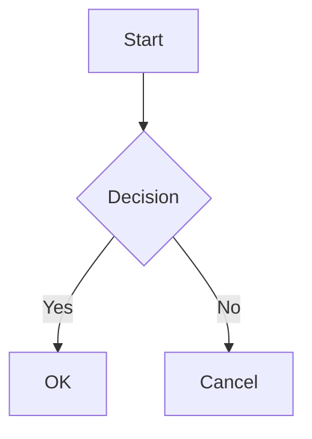

# @ai-markdown/react-mantine

> **3.0.0-beta.2 candidate (unreleased):** the new `@ai-markdown` scope separates the shared core from the React adapter. Install framework packages with `@beta`; The Vue adapter is implemented in source; its first npm publication is pending. See the [migration guide](../../docs/framework-transition.md).

[](https://www.npmjs.com/package/@ai-markdown/react-mantine)
[](https://www.npmjs.com/package/@ai-markdown/react-mantine)
[](https://bundlephobia.com/package/@ai-markdown/react-mantine)
[](https://www.typescriptlang.org/)

[](https://react.dev/)
[](https://nodejs.org/)
[](#installation)
[](https://mantine.dev/)
[](https://github.com/ai-markdown/ai-markdown/blob/main/LICENSE)

[](https://github.com/ai-markdown/ai-markdown/actions/workflows/ci.yml)
[](https://github.com/ai-markdown/ai-markdown/actions/workflows/release.yml)
[](https://github.com/ai-markdown/ai-markdown)

`@ai-markdown/react-mantine` adds Mantine presentation to the React renderer: theme-aware typography, expandable highlighted code, source-preserving JSON formatting, and Mermaid diagrams. Its `MantineAIMarkdown` wrapper accepts the React adapter's props and adds one `codeBlock` behavior group.

Parsing, URL policy, metadata, and cross-chunk references remain engine/React adapter responsibilities. The integration supplies default slots and a `pre` renderer; caller overrides take precedence. Set up the stylesheet imports and both providers in the quick start before using the code-block features. If you replace `pre`, your component takes over the formatting, copy, highlighting, and diagram behavior described here.

> **Upgrading from 1.x?** v2.0.0 removes the 1.x object-based `config` channel — the Mantine code-block options move to a flat `codeBlock` prop, and the render-state hook is replaced by narrow hooks plus `useMantineCodeBlockOptions()`. See the [migration guide](https://github.com/ai-markdown/ai-markdown/blob/main/docs/migrating-to-v2.md).

## What It Adds on Top of Core

- **Mantine typography** -- markdown content is wrapped in Mantine's `<Typography>` so it inherits the active theme's font family, line height, and color tokens
- **Syntax highlighting** -- code blocks render via `@mantine/code-highlight` (powered by highlight.js), with language-labelled tabs, expand/collapse, and optional auto-detection for unlabelled blocks
- **Mermaid diagrams** -- fenced `mermaid` code blocks render as interactive SVG diagrams with dark/light theme support, source toggle, copy, and open-in-new-window
- **JSON pretty-print** -- fenced `json` code blocks are validated and formatted with 2-space indent while retaining numeric tokens, duplicate keys, and key order; string values that are themselves JSON documents (an object or array — the tool-call transcript shape) are expanded too, primitive-looking strings (`"true"`, `"123"`) are left as written
- **Automatic color scheme** -- detects Mantine's computed color scheme (`useComputedColorScheme`) and forwards it to the core renderer when no explicit `colorScheme` prop is supplied
- **Mantine-scoped CSS** -- extra-styles wrapper overrides Mantine spacing/font-size custom properties to use relative `em` units, giving consistent scaling at any base font size

All core features (GFM, LaTeX math, CJK support, streaming, metadata context, content preprocessors, custom components, cross-chunk coordination via `<AIMarkdownDocuments>`) are inherited unchanged from `@ai-markdown/react`. See the [React README](https://github.com/ai-markdown/ai-markdown/blob/main/packages/react/README.md) for the base API.

## Package family

| Package                                                                                                  | Role                                                                                                        | Version policy                                            |
| -------------------------------------------------------------------------------------------------------- | ----------------------------------------------------------------------------------------------------------- | --------------------------------------------------------- |
| [`@ai-markdown/core`](https://www.npmjs.com/package/@ai-markdown/core)                                   | Framework-independent sessions, block planning, contributions and smooth coordination                       | Release train; exact engine dependency                    |
| [`@ai-markdown/react`](https://www.npmjs.com/package/@ai-markdown/react)                                 | The React renderer — `<AIMarkdown>`, `<AIMarkdownSmoothStream>`, `<AIMarkdownDocuments>`, hooks, providers  | Release train                                             |
| [`@ai-markdown/react-mantine`](https://www.npmjs.com/package/@ai-markdown/react-mantine)                 | Mantine UI bindings — themed typography, code-highlight tabs, Mermaid, color-scheme wiring                  | Release train; exact React peer during beta               |
| [`@ai-markdown/engine`](https://www.npmjs.com/package/@ai-markdown/engine)                               | Framework-agnostic engine — incremental parsing, LaTeX preprocessing, plugin pipeline, cross-chunk registry | Release train; pinned exactly by shared core and adapters |
| [`@ai-markdown/remark-mark-highlight`](https://www.npmjs.com/package/@ai-markdown/remark-mark-highlight) | remark plugin for `==mark==` highlight syntax                                                               | Independent semver                                        |

## Compatibility

|                |                                                                                                        |
| -------------- | ------------------------------------------------------------------------------------------------------ |
| Mantine        | `@mantine/core` ^9 and `@mantine/code-highlight` ^9 (peer dependencies)                                |
| highlight.js   | ^11.11 (peer; loaded on demand for auto-detection, otherwise via your adapter)                         |
| React          | ≥ 19                                                                                                   |
| Node           | ≥ 20 (`engines.node`)                                                                                  |
| Module formats | ESM and CJS with types; the compiled stylesheet is exported as `@ai-markdown/react-mantine/styles.css` |
| Core           | Core peer `^2.13.3` in this checkout; publish versions follow the core release train                   |

## Installation

```bash
# npm
npm install @ai-markdown/react-mantine@beta @ai-markdown/react@beta

# pnpm
pnpm add @ai-markdown/react-mantine@beta @ai-markdown/react@beta

# yarn
yarn add @ai-markdown/react-mantine@beta @ai-markdown/react@beta
```

### Peer Dependencies

```json
{
  "react": "^19.0.0",
  "react-dom": "^19.0.0",
  "@ai-markdown/react": "3.0.0-beta.2",
  "@mantine/core": "^9.0.0",
  "@mantine/code-highlight": "^9.0.0",
  "highlight.js": "^11.11.2"
}
```

### CSS Dependencies

Import the required stylesheets in your application entry point:

```tsx
// Mantine core styles (required)
import '@mantine/core/styles.css';

// Mantine code highlight styles (required for code blocks)
import '@mantine/code-highlight/styles.css';

// Mantine AI Markdown styles (required for extra styles + Mermaid)
import '@ai-markdown/react-mantine/styles.css';

// KaTeX styles (required for LaTeX math rendering)
import 'katex/dist/katex.min.css';
```

## Quick Start

```tsx
import { MantineProvider } from '@mantine/core';
import { CodeHighlightAdapterProvider, createHighlightJsAdapter } from '@mantine/code-highlight';
import hljs from 'highlight.js';
import MantineAIMarkdown from '@ai-markdown/react-mantine';

const highlightJsAdapter = createHighlightJsAdapter(hljs);

function App() {
  return (
    <MantineProvider>
      <CodeHighlightAdapterProvider adapter={highlightJsAdapter}>
        <MantineAIMarkdown content="Hello **world**! Math: $E = mc^2$" />
      </CodeHighlightAdapterProvider>
    </MantineProvider>
  );
}
```

### Streaming Example

```tsx
function StreamingChat({ content, isStreaming }: { content: string; isStreaming: boolean }) {
  return <MantineAIMarkdown content={content} streaming={isStreaming} />;
}
```

## Props API Reference

### `MantineAIMarkdownProps<TMetadata>`

`MantineAIMarkdownProps<TMetadata>` extends `AIMarkdownProps<TMetadata>` -- every core prop (`enginePlugins`, `blockMemo`, `incrementalParse`, `preserveOrphanReferences`, `streamingCursor`, …) is supported, plus the Mantine-specific `codeBlock` prop. The table below lists the props with a Mantine-specific default override or addition (props not listed here inherit core defaults unchanged — see the [core props table](https://github.com/ai-markdown/ai-markdown/blob/main/packages/react/README.md#aimarkdownpropstmetadata)).

| Prop                   | Type                               | Default                          | Description                                                                                                                                                                                                                    |
| ---------------------- | ---------------------------------- | -------------------------------- | ------------------------------------------------------------------------------------------------------------------------------------------------------------------------------------------------------------------------------ |
| `content`              | `string`                           | **(required)**                   | Raw markdown content to render.                                                                                                                                                                                                |
| `streaming`            | `boolean`                          | `false`                          | Whether content is actively being streamed.                                                                                                                                                                                    |
| `fontSize`             | `number \| string`                 | `'0.9375rem'`                    | Base font size. Numbers are treated as pixels. Inherited from core.                                                                                                                                                            |
| `variant`              | `AIMarkdownVariant`                | `'default'`                      | Typography variant name.                                                                                                                                                                                                       |
| `colorScheme`          | `AIMarkdownColorScheme`            | Auto-detected                    | Color scheme. When omitted, defaults to Mantine's computed color scheme via `useComputedColorScheme('light')`.                                                                                                                 |
| `metadata`             | `TMetadata`                        | `undefined`                      | Arbitrary data for custom components via dedicated context.                                                                                                                                                                    |
| `contentPreprocessors` | `AIMDContentPreprocessor[]`        | `undefined`                      | Additional preprocessors run after the built-in LaTeX preprocessor.                                                                                                                                                            |
| `customComponents`     | `AIMarkdownCustomComponents`       | Mantine defaults                 | Component overrides, merged with Mantine's built-in `<pre>` handler. Caller overrides take precedence -- including `pre` here disables Mantine's code-block features.                                                          |
| `Typography`           | `AIMarkdownTypographyComponent`    | `MantineAIMarkdownTypography`    | Typography wrapper component.                                                                                                                                                                                                  |
| `ExtraStyles`          | `AIMarkdownExtraStylesComponent`   | `MantineAIMDefaultExtraStyles`   | Extra style wrapper rendered between typography and content.                                                                                                                                                                   |
| `documentId`           | `string`                           | auto via `useId()`               | Stable id namespace for clobberable attributes. See the [core docs](https://github.com/ai-markdown/ai-markdown/blob/main/packages/react/README.md#aimarkdownpropstmetadata) for full semantics. Required for cross-chunk mode. |
| `codeBlock`            | `Partial<MantineCodeBlockOptions>` | `defaultMantineCodeBlockOptions` | Code-block behavior group (Mantine-specific). The group value replaces atomically; omitted fields resolve to the shipped defaults inside `useMantineCodeBlockOptions()`. `null` counts as absent.                              |

## Configuration

The `codeBlock` prop transports a partial behavior group. An absent or null group contributes no `codeBlock` key, so an outer `AIMarkdownBehaviorsProvider` can supply it. A present group replaces an outer group atomically: `{ defaultExpanded: false }` does not inherit the outer group's other fields. The narrow hook fills omitted fields from package defaults.

### `codeBlock` (`Partial<MantineCodeBlockOptions>`)

| Field                       | Type      | Default | Behavior                                                                                 |
| --------------------------- | --------- | ------- | ---------------------------------------------------------------------------------------- |
| `defaultExpanded`           | `boolean` | `true`  | Initial expanded state; false starts long blocks collapsed with an expand action         |
| `autoDetectUnknownLanguage` | `boolean` | `false` | Guess an unannotated block's language with highlight.js                                  |
| `formatJson`                | `boolean` | `true`  | Format valid JSON for display while preserving numeric tokens, duplicate keys, and order |
| `expandNestedJson`          | `boolean` | `true`  | While formatting, expand string values that contain JSON objects or arrays               |
| `highlightIntervalMs`       | `number`  | `50`    | Coalesce appended code display updates during streaming; zero displays every update      |

Explicit undefined fields retain their shipped defaults. The highlight interval must be finite and non-negative; invalid values fall back to 50 ms. Do not assume that null is a supported value for individual fields merely because null at the group boundary counts as absent.

### Example: Collapsed Code Blocks

```tsx
<MantineAIMarkdown content={markdown} codeBlock={{ defaultExpanded: false }} />
```

The omitted options resolve to the defaults in the table. To keep JSON structure exactly as written apart from whitespace, set `expandNestedJson: false`; to display the original JSON text, set `formatJson: false`. Neither setting changes what the copy button copies.

For a stable reusable fragment, use the widened factory:

```tsx
import { defineMantineBehaviors } from '@ai-markdown/react-mantine';

const BEHAVIORS = defineMantineBehaviors({
  blockMemo: true,
  codeBlock: { defaultExpanded: false, expandNestedJson: false },
});

<MantineAIMarkdown content={markdown} {...BEHAVIORS} streaming={isStreaming} />;
```

The factory provides types and shallow freezing, not default resolution or recursive merging. Runtime props placed after a spread win in ordinary JSX order. Behavior-group defaults are applied only by `useMantineCodeBlockOptions()`, so custom code renderers should read that hook rather than reproduce the table locally.

## Hooks

### `useMantineCodeBlockOptions()`

Narrow hook for the `codeBlock` behavior group -- the single place the group's type assertion and defaults live. Returns `Required<MantineCodeBlockOptions>`: the caller-passed group merged over `defaultMantineCodeBlockOptions`.

```tsx
import { useMantineCodeBlockOptions } from '@ai-markdown/react-mantine';

function MyCodeBlock() {
  const { defaultExpanded, autoDetectUnknownLanguage } = useMantineCodeBlockOptions();
  // ...
}
```

For everything else (streaming state, theme, document ids, core behavior switches), use the React adapter's narrow hooks directly -- `useAIMarkdownState()`, `useAIMarkdownTheme()`, `useAIMarkdownDocument()`, `useAIMarkdownBehaviors()` -- or the aggregate `useAIMarkdown()` for low-frequency components. See the [core hooks reference](https://github.com/ai-markdown/ai-markdown/blob/main/packages/react/README.md#hooks).

```tsx
import { useAIMarkdownState, useAIMarkdownTheme } from '@ai-markdown/react';
import { useMantineCodeBlockOptions } from '@ai-markdown/react-mantine';

function MyCodeBlock() {
  const { streaming } = useAIMarkdownState();
  const { colorScheme } = useAIMarkdownTheme();
  const { defaultExpanded } = useMantineCodeBlockOptions();
  // ...
}
```

### `useMantineAIMarkdownMetadata<TMetadata>()`

Typed wrapper around the core `useAIMarkdownMetadata`, defaulting `TMetadata` to `MantineAIMarkdownMetadata`. Metadata lives in a separate React context from render state, so metadata updates do not cause re-renders in components that only consume render state.

```tsx
import { useMantineAIMarkdownMetadata } from '@ai-markdown/react-mantine';

function MyComponent() {
  const metadata = useMantineAIMarkdownMetadata<{ messageId: string }>();
  // ...
}
```

## Typography and Styling

### `MantineAIMarkdownTypography`

Default typography wrapper. Renders Mantine's `<Typography>` with `w="100%"` and `fz={fontSize}`, so all rendered markdown inherits the active theme's font family, line height, and color tokens. Receives the `style` prop carrying the React adapter's CSS custom properties (`--aim-font-size-root`) and forwards it onto the Mantine root.

Replace it via the `Typography` prop when you need different theming, but consider extending rather than replacing -- the wrapper is intentionally minimal.

### `MantineAIMDefaultExtraStyles`

Default `ExtraStyles` wrapper. Renders a `<div className="aim-mantine-extra-styles">` that activates the package's scoped CSS overrides:

- Mantine spacing and font-size CSS custom properties switched to relative `em` units (consistent scaling at any base font size)
- Heading, list, paragraph, blockquote, and inline-code spacing tuned for AI-generated markdown
- Definition list layout

Activated by importing `@ai-markdown/react-mantine/styles.css` in your app entry. Pass a custom `ExtraStyles` prop to bypass these defaults.

## Code Block Rendering

The Mantine package installs a default `<pre>` renderer (`MantineAIMPreCode`) that powers all code-block features. Behavior by code-block flavor:

| Code-block flavor                          | Rendered as                 | Notes                                                                                                                                                                                                                                                                                                                                                    |
| ------------------------------------------ | --------------------------- | -------------------------------------------------------------------------------------------------------------------------------------------------------------------------------------------------------------------------------------------------------------------------------------------------------------------------------------------------------- |
| Annotated, known language (e.g. ` ```ts `) | `<CodeHighlightTabs>`       | Tab label = language name (lower-cased)                                                                                                                                                                                                                                                                                                                  |
| Annotated, unknown language identifier     | `<CodeHighlightTabs>`       | Tab label = the identifier (lower-cased); Mantine's highlight adapter degrades an unknown language to plaintext                                                                                                                                                                                                                                          |
| No language annotation                     | `<CodeHighlight>` plaintext | Label = `"unknown"`. With `codeBlock.autoDetectUnknownLanguage: true`, `hljs.highlightAuto` guesses early, re-checks as the block grows, and settles at end of stream — label/highlighting upgrade in place                                                                                                                                              |
| ` ```mermaid ` (any case)                  | Interactive Mermaid diagram | See [Mermaid Diagrams](#mermaid-diagrams); the language match is case-insensitive                                                                                                                                                                                                                                                                        |
| ` ```json ` (any case)                     | Pretty-printed JSON         | As soon as the block looks complete (ends in `}`/`]` with balanced brackets outside strings), parsed, string values holding a nested JSON object/array expanded (primitive-looking strings such as `"true"` stay strings), then formatted with 2-space indent while retaining exact numeric tokens; both formatting and nested expansion can be disabled |

The copy control copies the original code text, including its trailing newline, independently of JSON display formatting. Raw HTML `<pre>` structures with nested elements, sibling text, or additional attributes retain their original rendering instead of entering the code highlighter.

All non-special blocks render with `withBorder` and `withExpandButton`, collapsing to `maxCollapsedHeight="320px"` until expanded.

### Code Highlight Adapter

Code highlighting requires a `CodeHighlightAdapterProvider` wrapping the component tree. This is a Mantine requirement -- the adapter bridges `highlight.js` into Mantine's code highlight components.

```tsx
import { CodeHighlightAdapterProvider, createHighlightJsAdapter } from '@mantine/code-highlight';
import hljs from 'highlight.js';

const highlightJsAdapter = createHighlightJsAdapter(hljs);

function App() {
  return (
    <CodeHighlightAdapterProvider adapter={highlightJsAdapter}>
      {/* MantineAIMarkdown components can be rendered anywhere below */}
    </CodeHighlightAdapterProvider>
  );
}
```

### Language Auto-Detection

By default, code blocks without an explicit language annotation render as plaintext. Enable auto-detection via the `codeBlock` prop:

```tsx
<MantineAIMarkdown content={markdown} codeBlock={{ autoDetectUnknownLanguage: true }} />
```

This uses `highlight.js`'s `highlightAuto` to guess the language. Results may vary for short or ambiguous snippets. While a block streams, detection runs on a doubling schedule — a first guess once the block has ~32 characters, a corrective re-run each time it has doubled in length, and a final verdict when the stream ends — so a long block gets an early label and periodic corrections at O(n) total cost instead of a full re-score on every chunk. A block that is replaced rather than appended to (a regenerate) restarts the schedule. Without a `streaming` prop the renderer cannot tell chunks apart and re-detects on every content change — pass `streaming` when you stream. The full `highlight.js` build is loaded on demand the first time it is needed; the package itself no longer imports the root `highlight.js` entry, so consumers who register only the languages they need via `highlight.js/lib/core` keep that bundle saving unless they turn this option on.

### Preloading the on-demand assets

`mermaid` and (for auto-detection) `highlight.js` are loaded lazily by the code-block renderers. An app that would rather pay that cost at startup — a documentation page whose first screen shows a diagram, or a chat UI that wants to reduce the first diagram’s module-loading delay — calls the exported helper once at boot:

```tsx
import { preloadMantineCodeAssets } from '@ai-markdown/react-mantine';

void preloadMantineCodeAssets(); // idempotent; failures are swallowed and the renderers fall back to lazy loading
```

Importing the modules yourself at app entry (`import 'mermaid'`) has the same effect under a bundler: the dynamic import then resolves to the already-loaded module.

## Mermaid Diagrams

Fenced code blocks with the `mermaid` language identifier render as interactive SVG diagrams. The `mermaid` module is loaded on demand — the first diagram that renders pays the import (the raw source shows as a code block while it loads), and in a code-splitting bundler this can defer its chunk until needed. Actual delivery depends on your bundler and any eager imports or preload call:

````markdown

````

Features:

- Automatic dark/light theme switching driven by Mantine's color scheme
- Toggle between rendered diagram and raw source
- Copy button for the Mermaid source
- Use the header action to open the SVG in a new window; the diagram itself retains its graphics semantics
- Chart type label displayed in the header
- Graceful fallback to source-code display on parse errors; the last successful render is preserved across transient parse failures during streaming

The `mermaid` library is a direct dependency of this package -- no additional installation is needed.

## Color Scheme Integration

`MantineAIMarkdown` resolves its color scheme in this order:

1. Explicit non-null `colorScheme` prop
   (undefined uses the wrapper default; runtime null reaches the React adapter’s fallback)
2. Mantine's `useComputedColorScheme('light')` -- the live computed scheme from the active `MantineProvider`

```tsx
// Follows Mantine's color scheme automatically
<MantineAIMarkdown content={markdown} />

// Explicit override
<MantineAIMarkdown content={markdown} colorScheme="dark" />
```

The resolved color scheme is forwarded to:

- The core `<AIMarkdown>` for typography theming
- Mermaid diagram rendering (dark / base theme selection)
- The extra-styles wrapper for color-aware CSS

## Custom Components

Caller-provided `customComponents` are merged on top of the Mantine defaults; caller overrides take precedence:

```tsx
import MantineAIMarkdown from '@ai-markdown/react-mantine';
import type { AIMarkdownCustomComponents } from '@ai-markdown/react';

const customComponents: AIMarkdownCustomComponents = {
  a: ({ href, children }) => (
    <a href={href} target="_blank" rel="noopener noreferrer">
      {children}
    </a>
  ),
  img: ({ src, alt }) => ,
};

<MantineAIMarkdown content={markdown} customComponents={customComponents} />;
```

To override the default `<pre>` handler (and lose built-in code highlighting, Mermaid, and JSON pretty-print support), include `pre` in your custom components.

## Cross-Chunk Coordination

`<MantineAIMarkdown>` participates in cross-chunk coordination identically to `<AIMarkdown>`. Wrap multiple chunks in `<AIMarkdownDocuments>` (from `@ai-markdown/react`) and share `documentId` to coordinate footnotes, link references, and image references across chunks:

```tsx
import { AIMarkdownDocuments } from '@ai-markdown/react';
import MantineAIMarkdown from '@ai-markdown/react-mantine';

<AIMarkdownDocuments>
  {message.chunks.map((c, i) => (
    <MantineAIMarkdown key={i} content={c} documentId={message.id} />
  ))}
</AIMarkdownDocuments>;
```

See the [React README's cross-chunk section](https://github.com/ai-markdown/ai-markdown/blob/main/packages/react/README.md#cross-chunk-coordination) for the full `<AIMarkdownDocuments>` API and `useDocumentRegistry` hook.

## Smooth Streaming

Typewriter pacing composes with `<MantineAIMarkdown>` through the React adapter's `useSmoothStream` hook — its result is props-shaped, so it spreads straight in:

```tsx
import { useSmoothStream } from '@ai-markdown/react';
import MantineAIMarkdown from '@ai-markdown/react-mantine';

function ChatMessage({ markdown, pending }: { markdown: string; pending: boolean }) {
  const smooth = useSmoothStream({ content: markdown, streaming: pending, pacing: 'balanced' });
  return <MantineAIMarkdown {...smooth} />;
}
```

For multi-chunk documents under `<AIMarkdownDocuments>`, swap in `useDocumentSmoothStream` and chunks sharing a `documentId` reveal turn-by-turn (one typewriter, one cursor). Pass the SAME id to the hook and the component — the hook can't cross-check the two:

```tsx
import { useDocumentSmoothStream } from '@ai-markdown/react';

function ChatChunk({ id, markdown, pending }: { id: string; markdown: string; pending: boolean }) {
  const smooth = useDocumentSmoothStream({ documentId: id, content: markdown, streaming: pending });
  return <MantineAIMarkdown {...smooth} documentId={id} />;
}
```

See [docs/smooth-streaming.md](https://github.com/ai-markdown/ai-markdown/blob/main/docs/smooth-streaming.md) for the pacing model, presets, and footguns.

## Architecture Overview

```text
<MantineAIMarkdown>
  └─ wraps <AIMarkdown> with Mantine defaults:
       Typography          = MantineAIMarkdownTypography      (Mantine <Typography>)
       ExtraStyles         = MantineAIMDefaultExtraStyles     (aim-mantine-extra-styles scope)
       customComponents.pre = MantineAIMPreCode               (CodeHighlight + Mermaid + JSON pretty-print)
       colorScheme         = useComputedColorScheme('light')  (when not overridden)
```

Caller-provided `Typography`, `ExtraStyles`, and `customComponents` props override the Mantine defaults at their respective slots. Inside the wrapped `<AIMarkdown>`, the rest of the render pipeline (the five per-system contexts, content preprocessors, remark/rehype plugin chain) is identical to standalone core -- see the [core architecture overview](https://github.com/ai-markdown/ai-markdown/blob/main/packages/react/README.md#architecture-overview).

## Exported API

### Default Export

- `MantineAIMarkdown` -- the main component (memoized)

### Components

- `MantineAIMarkdownTypography` -- Mantine-themed typography wrapper
- `MantineAIMDefaultExtraStyles` -- default extra styles wrapper with Mantine CSS scoping

### Types

- `MantineAIMarkdownProps`
- `MantineAIMarkdownMetadata`
- `MantineCodeBlockOptions` -- the `codeBlock` group shape
- `MantineBehaviorProps` -- input type of `defineMantineBehaviors`

### Constants

- `defaultMantineCodeBlockOptions` -- shipped defaults of the `codeBlock` behavior group (frozen)

### Asset helpers

- `preloadMantineCodeAssets()` — starts the lazy Mermaid and auto-detection imports; idempotent, with renderer fallback if loading fails

### Factories

- `defineMantineBehaviors()` -- widened behaviors factory (core behavior fields + `codeBlock`); identity + types + `Object.freeze`, zero logic

### Hooks

- `useMantineCodeBlockOptions()` -- typed access to the `codeBlock` group with defaults applied
- `useMantineAIMarkdownMetadata<TMetadata>()` -- typed metadata access

## Documentation

Everything below applies unchanged through `<MantineAIMarkdown>`; the mantine-specific parts are the sections above.

| Guide                                                                                                                                                                                                                                                                                                   | What it covers                                                                           |
| ------------------------------------------------------------------------------------------------------------------------------------------------------------------------------------------------------------------------------------------------------------------------------------------------------- | ---------------------------------------------------------------------------------------- |
| [Streaming & performance](https://github.com/ai-markdown/ai-markdown/blob/main/docs/streaming-and-performance.md)                                                                                                                                                                                       | Block memoization, incremental (prefix-freeze) parsing, what to pass while tokens arrive |
| [Smooth streaming](https://github.com/ai-markdown/ai-markdown/blob/main/docs/smooth-streaming.md)                                                                                                                                                                                                       | `<AIMarkdownSmoothStream>` typewriter reveal, pacing presets, document turn-taking       |
| [Streaming cursor](https://github.com/ai-markdown/ai-markdown/blob/main/docs/streaming-cursor.md)                                                                                                                                                                                                       | The overlay cursor that tracks the streaming tail                                        |
| [Cross-chunk coordination](https://github.com/ai-markdown/ai-markdown/blob/main/docs/cross-chunk-coordination.md)                                                                                                                                                                                       | `<AIMarkdownDocuments>`, footnotes and link references across chunks, the registry       |
| [URL sanitization & custom schemes](https://github.com/ai-markdown/ai-markdown/blob/main/docs/url-sanitization.md)                                                                                                                                                                                      | The two-gate model, `urlTransform`, `extendSanitizeSchema`                               |
| [Custom components](https://github.com/ai-markdown/ai-markdown/blob/main/docs/custom-components.md) · [Custom typography](https://github.com/ai-markdown/ai-markdown/blob/main/docs/custom-typography.md) · [Design tokens](https://github.com/ai-markdown/ai-markdown/blob/main/docs/design-tokens.md) | Swapping renderers, theming, the `--aim-*` variables                                     |
| [CJK typography](https://github.com/ai-markdown/ai-markdown/blob/main/docs/cjk-typography.md)                                                                                                                                                                                                           | Line breaking, spacing, pangu                                                            |
| [Metadata context](https://github.com/ai-markdown/ai-markdown/blob/main/docs/metadata-context.md) · [TypeScript generics](https://github.com/ai-markdown/ai-markdown/blob/main/docs/typescript-generics.md)                                                                                             | Passing typed metadata to custom components                                              |
| [Content preprocessors](https://github.com/ai-markdown/ai-markdown/blob/main/docs/content-preprocessors.md)                                                                                                                                                                                             | Rewriting the source before it parses                                                    |
| [Extending via subpackage](https://github.com/ai-markdown/ai-markdown/blob/main/docs/extending-via-subpackage.md)                                                                                                                                                                                       | Building your own UI-kit binding (the mantine package is the reference)                  |
| [Architecture](https://github.com/ai-markdown/ai-markdown/blob/main/docs/architecture.md) · [Benchmark](https://github.com/ai-markdown/ai-markdown/blob/main/docs/benchmark.md)                                                                                                                         | How the packages fit together, measured numbers                                          |
| [Migrating to v2](https://github.com/ai-markdown/ai-markdown/blob/main/docs/migrating-to-v2.md) · [Release highlights](https://github.com/ai-markdown/ai-markdown/blob/main/docs/release-highlights.md)                                                                                                 | Old → new API mapping, what changed per version                                          |

## Core Package

For base features, configuration options, content preprocessors, TypeScript generics, and architecture details, see the [`@ai-markdown/react` README](https://github.com/ai-markdown/ai-markdown/blob/main/packages/react/README.md).

## Streaming code: source, display, and asynchronous work

Ordinary code highlighting has separate source and display values. The latest source updates immediately for copying, while append-only streaming display updates can be coalesced over `highlightIntervalMs`. This is a bounded pending update: new appends do not keep postponing the same deadline indefinitely. Completion, replacement, language changes, and non-streaming updates bypass the interval so the final view catches up immediately.

The highlighter retains only its latest result for the same code, language, color scheme, and highlight function. It is not an unbounded cache of every streamed prefix. JSON formatting first validates a complete candidate, then formats tokens without converting number spellings through a stringify round trip. A nested JSON string expands only when it contains an object or array; primitive-looking strings stay strings. Nested expansion changes the display structure, so disable it when showing that distinction matters.

Mermaid has a separate asynchronous lifecycle. Initialization, parsing, and rendering are serialized, with only the latest pending request retained per instance. During an incomplete stream, the last valid diagram remains visible after transient failures; before a valid diagram exists, source provides the fallback. Completion triggers the final corrective render. The renderer enforces strict Mermaid security configuration and handles diagram generation independently of ordinary highlight coalescing.

Only a plain pre/code shape is eligible for replacement: one positioned code child containing text, no pre attributes, and no code attributes beyond language classes. Raw HTML with nested markup, siblings, or extra attributes remains a normal pre element, preserving information a highlighter would otherwise discard. A caller-provided `pre` override replaces this entire decision path; a `code` override alone does not intercept fences consumed by Mantine's pre renderer.

## Verify an application setup

Check light and dark schemes, a known language, an unannotated block, JSON with a large numeric literal, a nested JSON string, and a Mermaid fence that is incomplete before becoming valid. Copy each source and compare its whitespace with the original. Then replace a block with different content of the same length, complete a stream during a pending highlight interval, and change the theme after a diagram has rendered.

For custom wrappers, test an outer behavior provider both with an absent `codeBlock` prop and a present partial group. For multiple logical chunks, use the same core `AIMarkdownDocuments` wrapper and explicit document ids; no Mantine-specific registry exists. Smooth presentation composes through the React adapter's hooks, whose returned streaming state includes the reveal drain.

See [`src/MantineAIMarkdown.tsx`](./src/MantineAIMarkdown.tsx) for wrapper precedence and [`src/defs.tsx`](./src/defs.tsx) for the authoritative group defaults. The package's README describes its presentation layer; the [React README](../react/README.md) remains the reference for inherited parsing and coordination behavior.

## License

MIT
